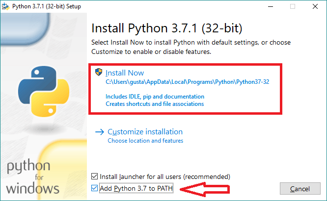

# CONTRIBUTING

O repositório `mais` contém o código base para os pacotes de **BD** em Python, R e Stata. Neste documento, detalhamos a configuração de ambiente necessária para contribuir em cada um dos nossos pacotes.

## Python

Clone o repositório principal:

```sh
git clone https://github.com/basedosdados/mais.git
```
Entre na pasta local do repositório usando `cd mais/` e suba o ambiente localmente:

```sh
make create-env
. .mais/bin/activate
cd python-package/
python setup.py develop
```

Após esses passos, seu ambiente estará configurado e você pode criar uma nova branch para desenvolver uma nova feature.

## Stata


 __Passo 1.__ Clique [aqui](https://www.python.org/downloads/) na opção "Download Python" para baixar o Python. Em seguida, siga as instruções da tela e, principalmente, _não esqueça_ de marcar a opção "add to path": 

<p align="left">
    <a href="https://github.com/basedosdados/mais/blob/master/stata-package/blob/main/examples/python1.png">
    
    </a>
</p>

__Passo 2.__ Após instalar o Python, abra o menu iniciar, digite "cmd" e abra. Na tela do "Prompt de Comando" que aparecerá, digite `pip install basedosdados -U` e dê enter.

<p align="left">
    <a href="https://github.com/basedosdados/mais/blob/master/stata-package/blob/main/examples/prompt.png">
    
    </a>
</p>

__Passo 3.__ Após concluir a instalação do pacote basedosdados, digite `basedosdados reauth` no Prompt de Comando. Copie o link que aparecerá, cole na sua aba de navegação e dê autorização ao google. Em seguida, copie o código gerado, volte e cole na tela do Prompt e dê enter.

>  Caso esteja utilizando os dados da BD pela primeira vez, é necessário criar um projeto para que você possa fazer as queries no nosso repositório. Ter um projeto é de graça e basta ter uma conta Google (seu gmail por exemplo). [Veja aqui como criar um projeto no Google Cloud](https://basedosdados.github.io/mais/access_data_bq/#antes-de-comecar-crie-o-seu-projeto-no-google-cloud).

Após finalizar esses 3 passos, já será possível abrir o Stata e começar a usar o pacote. Para saber mais sobre os comandos do pacote, leia esse manual [aqui](https://github.com/basedosdados/mais/tree/master/stata-package). 

Com a conclusão da configuração do ambiente, você pode criar uma nova branch para desenvolver uma nova feature..