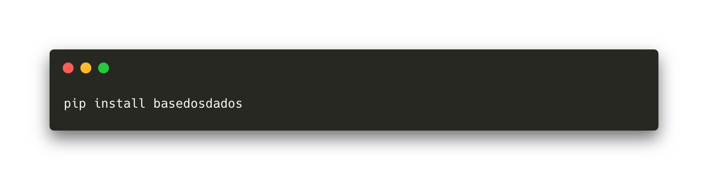

<!-- Header -->
<p align="center">
  <a href="https://basedosdados.github.io/mais/">
    
  </a>
</p>


<p align="center">
    <em>Mecanismo de busca e <b>repositório</b> de bases de dados brasileiras e internacionais.</em>
</p>

<p align="center">
  <a href="https://github.com/basedosdados/mais/subscription" target="_blank">
    
  </a>
  <a href="https://github.com/basedosdados/mais/stargazers" target="_blank">
    
  </a>
  <a href="https://apoia.se/basedosdados" target="_blank">
    
  </a>
  </div>
  <a href="https://twitter.com/intent/tweet?text=Baixe%20e%20faça%20queries%20em%20dados%20publicos,%20tratados%20e%20gratuitos%20com%20a%20Base%20dos%20Dados%20Mais%20🔍%20➕:%20https://basedosdados.github.io/mais/%20via%20@basedosdados" target="_blank">
    
  </a>
</p>

---

## Base dos Dados Mais

Uma simples consulta de SQL é o suficiente para cruzamento de bases que
você desejar. Sem precisar procurar, baixar, tratar, comprar um servidor
e subir clusters.

Nosso repositório traz acesso, rapidez, escala, facilidade, economia,
curadoria, e transparência ao cenário de dados no Brasil.


<p align="center" display="inline-block">
  <a href="https://console.cloud.google.com/bigquery?p=basedosdados&page=project" target="_blank">
    
  </a>
  <a href="https://basedosdados.github.io/mais" target="_blank" display="inline-block" margin="200">
    
  </a>
</p>

## Instale nosso CLI

[](basedosdados.github.io/mais)


## Por que o BigQuery?

- **Acesso**: É possível deixar os dados públicos, i.e., qualquer
  pessoa com uma conta no Google Cloud pode fazer uma query na base,
  quando quiser.
- **Rapidez**: Uma query muito longa não demora menos de minutos para
  ser processada.
- **Escala**: O BigQuery escala magicamente para hexabytes se necessário.
- **Facilidade**: Você pode cruzar tabelas tratadas e atualizadas num só lugar.
- **Economia**: O custo é praticamente zero para usuários - **1
  TB gratuito por mês para usar como quiser**. Depois disso, são cobrados
  somente 5 dólares por TB de dados que sua query percorrer.

## Contribua! 💚

**Incentivamos que outras instituições e pessoas contribuam**. Veja mais
como contribuir [aqui](https://basedosdados.github.io/mais/github/).

## Como citar o projeto 📝

O projeto está licenciado sob a [Licença Hipocrática](https://firstdonoharm.dev/version/2/1/license.html). Sempre que usar os dados cite a fonte como:

> Carabetta, J.; Dahis, R.; Israel, F.; Scovino, F. (2020) Base dos Dados Mais: Repositório de Dados. Github - https://github.com/basedosdados/mais.

## Idiomas

Documentação está em português (quando possível), código e configurações
estão em inglês.

## Desenvolvimento

#### CLI

Suba o CLI localmente

```sh
make create-env
. .mais/bin/activate
python setup.py develop
```

#### Versionamento

Publique nova versão

```sh
poetry version [patch|minor|major]
poetry publish --build
```

#### Docs
Atualize os docs adicionando ou editando `.md` em `docs/`.

Se for adicionar um arquivo novo, adicione ele em `mkdocs.yml` sob a chave `nav`.

Para testar a documentação, rode:

```sh
mkdocs serve 
```
