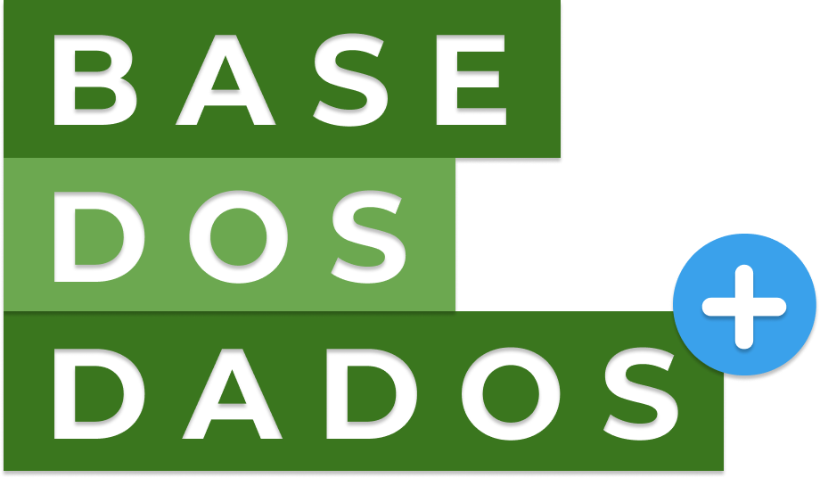

<!-- Header -->
<p align="center">
  <a href="https://basedosdados.org">
    
  </a>
</p>


<p align="center">
    <em>Universalizando o acesso a dados de qualidade no Brasil.</em>
</p>

<p align="center">
  <a href="https://github.com/basedosdados/mais/subscription" target="_blank">
    
  </a>
  <a href="https://github.com/basedosdados/mais/stargazers" target="_blank">
    
  </a>
  <a href="https://twitter.com/basedosdados" target="_blank">
    
  </a>
<!--   <a href="https://pypi.org/project/basedosdados/" target="_blank">
    
  </a> -->
  <a href="https://discord.gg/huKWpsVYx4" target="_blank">
    
  </a>
  <a href="https://apoia.se/basedosdados" target="_blank">
    
  </a>
</p>

A Base dos Dados (BD) é um datalake público no Google BigQuery com
os principais conjuntos de dados abertos do Brasil.
Na BD você encontra tabelas tratadas e prontas para uso de forma
gratuita. Disponibilizamos e mantemos neste projeto pacotes de acesso à
BD em diferentes linguagens.

> O projeto faz parte da [Base dos Dados](http://basedosdados.org), uma organização sem fins lucrativos com a
missão de universalizar o acesso a dados de qualidade para todes.

### Versões atuais

| **R** | **Python** | **Stata**
|-----|-----|-----|
| `install.packages("basedosdados")` | `pip install basedosdados` | - |
| <a href="https://CRAN.R-project.org/package=basedosdados" target="_blank"></a> | <a href="https://pypi.org/project/basedosdados" target="_blank"></a> | <a href="https://github.com/basedosdados/mais/pull/754" target="_blank"></a>
| <a href="https://CRAN.R-project.org/package=basedosdados" target="_blank"></a> | <a href="https://pypi.org/project/basedosdados" target="_blank"></a> |
| <a href="https://github.com/basedosdados/mais/labels/R" target="_blank"></a> | <a href="https://github.com/basedosdados/mais/labels/python" target="_blank"></a> |

## Encontre aqui

- 📝 [Como citar o projeto](#como-citar-o-projeto)
- 🐍 [Usando em Python](#usando-em-python)
-  [Usando em R](#usando-em-r)
- Análises e tutoriais:
  -  [Códigos de análises publicadas nas redes, workshops e artigos ↗](http://github.com/basedosdados/analises)
  -   [Youtube ↗](https://www.youtube.com/c/BasedosDados)
  -   [Medium ↗](http://dev.to/basedosdados)
- [⚙️ Desenvolvimento](#desenvolvimento)
- [👥 Como contribuir ↗](https://basedosdados.github.io/mais/colab_data/)
- [💚 Apoie o projeto! ↗](https://apoia.se/basedosdados)

## Como citar o projeto

O projeto (software) está sob licenca MIT - logo, pode ser utilizado e modificado sem restrições desde que sejam remetidos os direitos autorais originais - veja o texto de referência [aqui](LICENSE).

Caso queira citar o projeto numa publicação, artigo ou na web, utilize o
modelo no menu ao lado conforme a imagem.

**💡 Quer divulgar seu projeto nas nossas redes? Envie para contato@basedosdados.org**


## Usando em Python


### Instale
```bash
pip install basedosdados
```

### Acesse uma tabela

```python
import basedosdados as bd

df = bd.read_table('br_ibge_pib', 'municipio', billing_project_id="<YOUR-PROJECT>")
```

> Caso esteja acessando da primeira vez, vão aparecer alguns passos na tela para autenticar seu projeto - basta segui-los!
>
> É necessário criar um projeto para que você possa fazer as queries no nosso repositório. Ter um projeto é de graça e basta ter uma conta Google (seu gmail por exemplo). [Veja aqui como criar um projeto no Google Cloud](https://basedosdados.github.io/mais/access_data_bq/#primeiros-passos).
>
> Se possível, armazene suas credenciais em um arquivo `dotenv`: `"billing_project_id=<suas_credenciais_do_projeto>" >> .env`


### Faça uma consulta

```python
import basedosdados as bd

# Bens dos candidatos de Tocantins em 2020
query = """
SELECT *
FROM `basedosdados.br_tse_eleicoes.bens_candidato`
WHERE ano = 2020
AND sigla_uf = 'TO'
"""

df = bd.read_sql(query, billing_project_id="<YOUR-PROJECT>")
```

> Caso esteja acessando da primeira vez, vão aparecer alguns passos na tela para autenticar seu projeto - basta segui-los!

### Veja todos os datasets disponíveis

```python
import basedosdados as bd

bd.list_datasets()
```

### Defina paramêtros utilizando as configurações do pacote

```py
import basedosdados as bd

# seta o billing_project_id global
bd.config.billing_project_id =  '<billing-project-id>'

query = """
SELECT
    *
FROM `basedosdados.br_bd_diretorios_brasil.municipio`
"""

df = bd.read_sql(query=query)
```

Para saber mais, veja os [exemplos](https://github.com/basedosdados/analises/tree/main/artigos) ou a [documentação da API](https://basedosdados.github.io/mais/api_reference_python/)

## Criando múltiplas configurações

Caso você precise ter uma configuração adicional, com uma `service account` diferente, você pode criar uma configuração e utilizá-la em conjunto com a default, apenas alterando um atributo. Você deverá fazer o processo abaixo usando o terminal, mas esta forma só funcionará no Python.

Para isso, siga os seguintes passos:

1. Renomeie a pasta com o comando abaixo (pode ser o nome que quiser)
    ```bash
    mv ~/.basedosdados ~/.basedosdados_default
   ```
2. Neste momento, o pacote não terá a configuração padrão. Assim, ao rodar o comando
    ```bash
      basedosdados config init
    ```
    ele irá criar uma nova configuração padrão, que será salva na pasta `~/.basedosdados` (que será recriada). Lembre-se de, no passo em que é oferecido um link do Google Cloud Platform (GCP) para criar a nova `service account`, observar que seu navegador esteja logado com a conta que você deseja utilizar.
3. Faça todo o processo como anteriormete, passando os parâmetros que deseja utilizar com esta nova conta, como o `path` dos metadados, o nome do `bucket` do Google Cloud Storage, etc.
4. Ao salvar as novas `service accounts` (prod e staging), certifique-se de salvar na pasta `.basedosdados` criada no passo 1. Na verdade, esta é apenas a repetição do processo de criação de uma nova configuração.
5. Renomeie a pasta criada no passo 1 para o nome que desejar, como `~/.bd_minha_nova_conta`.
6. Caso você queira que a primeira configuração seja a padrão, retorne o nome da pasta modificada anterioremnte (`.basedosdados_default`) para o valor utilizado como padrão pelo pacote `basedosdados`, usando o comando `mv ~/.basedosdados_default ~/.basedosdados`.
7. A partir de agora, você poderá usar a nova conta (no Python), bastando utilizar o seguinte processo:
    ```py
    import basedosdados as bd
    bd.config.project_config_path = f"{home}/.bd_minha_nova_conta"
    ```
    e, se quiser voltar para a configuração padrão, basta utilizar o comando
    ```py
    bd.config.project_config_path = f"{home}/.basedosdados"
    ```
    Importante observar que, ao alterar o path de configuração do Python ele valerá para a sessão. Então é recomendável que ele seja usado com cuidado, evitanto trocas numa mesma sessão - especialmente quando estiver usando `Jupyter Notebook` onde é comum a reutilização de células anteriores, sem redefinição de variáveis e atributos anteriormente setados.

## Usando em R

### Instalação

```R
install.packages("basedosdados")

# ou a versão de desenvolvimento

devtools::install_github("basedosdados/mais", subdir = "r-package")
```

### Consultas

`read_sql` executa queries no banco e as devolve em dataframes (sempre na classe `tibble`), `download` escreve o resultado da query em um arquivo `.csv` no disco.

```r
library(basedosdados)

set_billing_id("id do seu projeto aqui") # autenticação para acesso aos dados

pib_per_capita <- "
SELECT
    pib.id_municipio ,
    pop.ano,
    pib.PIB / pop.populacao as pib_per_capita
FROM `basedosdados.br_ibge_pib.municipio` as pib
  INNER JOIN `basedosdados.br_ibge_populacao.municipio` as pop
  ON pib.id_municipio = pop.id_municipio AND pib.ano = pop.ano"

(data <- read_sql(pib_per_capita)) # leia os dados em memória
download(pib_per_capita, "pib_per_capita.csv") # salve os dados em disco
```

Ou use o nosso backend para o `dplyr` e faça queries com código, sem SQL.

```r
  query <- basedosdados::bdplyr("br_inep_ideb.municipio") %>%
    dplyr::select(ano, id_municipio, sigla_uf, ideb) %>%
    dplyr::filter(sigla_uf == "AC", ano < 2021) %>%
    dplyr::group_by(ano) %>%
    dplyr::summarise(ideb_medio = mean(ideb, na.rm = TRUE))

  basedosdados::bd_collect(query) # retorne como um tibble
  basedosdados::bd_write_csv(query, "ideb_medio.csv")
  basedosdados::bd_write_rds(query, "ideb_medio.rds")
```

`bd_write` é uma extensão para formatos customizados.

```r
  basedosdados::bd_write(query, .write_fn = writexl::write_xlsx, "ideb_medio.xlsx")
  basedosdados::bd_write(query, .write_fn = jsonlite::write_json, "ideb_medio.json")
  basedosdados::bd_write(query, .write_fn = haven::write_dta, "ideb_medio.dta")
```

O argumento `.write_fn` espera uma função que receba como argumento um tibble e um endereço de escrita, compatível com a interface convencional da língua para escrever arquivos em disco. A princípio, _toda_ função `write_*` disponível no CRAN deve funcionar.

Caso encontre algum problema no pacote e queira ajudar, basta documentar o problema em um [exemplo mínimo reprodutível](https://pt.stackoverflow.com/questions/264168/quais-as-principais-fun%C3%A7%C3%B5es-para-se-criar-um-exemplo-m%C3%ADnimo-reproduz%C3%ADvel-em-r) e abrir uma issue.

## Metadados e buscas

Você pode fazer buscas por tabelas usando palavras-chave ou buscar descrições de conjuntos e tabelas:

```r
dataset_search("educação")
get_dataset_description("br_sp_alesp")
get_table_description("br_sp_alesp", "deputado")
```

## Atenção

> Caso esteja acessando da primeira vez, vão aparecer alguns passos na tela para autenticar seu projeto com sua conta google e possivelmente na [Tidyverse API](https://www.tidyverse.org/google_privacy_policy/) - basta segui-los! As credenciais ficam armazenadas no computador então usuários com mais de uma máquina talvez precisem autenticar mais de uma vez.
> É necessário criar um projeto para que você possa fazer as queries no nosso repositório. Ter um projeto é de graça e basta ter uma conta Google (seu gmail por exemplo). [Veja aqui como criar um projeto no Google Cloud](https://basedosdados.github.io/mais/access_data_bq/#primeiros-passos).
> Se possível, armazene suas credenciais em um arquivo `dotenv`, em bash o comando é `"billing_project_id=<suas_credenciais_do_projeto>" >> .env`. [Veja aqui como criar um arquivo dotenv](https://towardsdatascience.com/using-dotenv-to-hide-sensitive-information-in-r-8b878fa72020).

## Desenvolvimento

### Documentação

Para rodar a documentação localmente:

```bash
python -m venv .mais # cria ambiente virtual (só rodar da primeira vez)
. .mais/bin/activate # ativa ambiente virtual
pip install --upgrade  -r python-package/requirements-dev.txt # instala dependências
python python-package/setup.py develop # instala pacote local
mkdocs serve # cria documentacao em: http://localhost:8000/
```

Atualize os docs adicionando ou editando os arquivos `.md` em `docs/`.

Para adicionar seu arquivo no sumário da documentação, adicione-o em
`mkdocs.yml` sob a chave `nav`:

```yaml
nav:
  - Home:
    - Aprenda sobre a BD: index.md
    - BigQuery: access_data_bq.md
    - Pacotes: access_data_packages.md
    - Contribua: colab.md
    - [Seu novo título]: <seu_arquivo>.md
```
