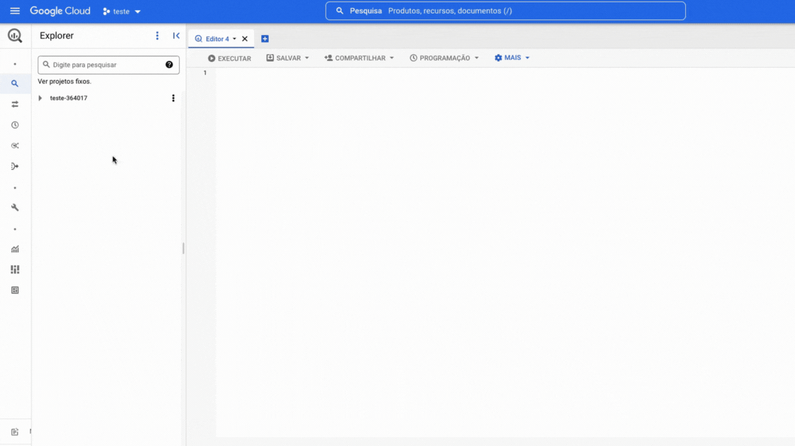
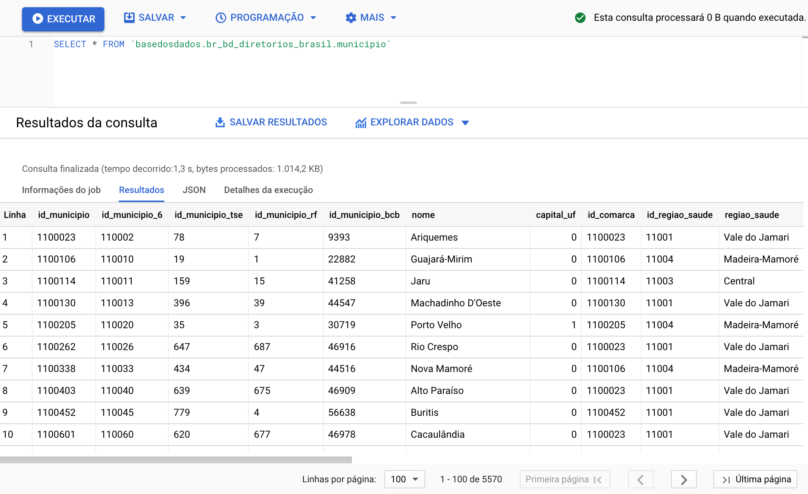

# BigQuery

O BigQuery é o um serviço de banco de dados em nuvem da
Google. Você faz consultas ao banco em SQL direto do navegador com:

- **Rapidez**: Mesmo queries muito longas demoram apenas minutos para serem processadas.

- **Escala**: O BigQuery escala magicamente para hexabytes se necessário.

- **Economia**: Todo usuário possui *1 TB gratuito por mês para consulta
  aos dados*.

Pronto(a) para começar? Nesta página você encontra:

- [Primeiros passos](#primeiros-passos)
- [Tutoriais](#tutoriais)
- [Manuais e Cursos de SQL](#manuais-e-cursos-de-sql)

## Primeiros passos

### Antes de começar: Crie o seu projeto no Google Cloud

Para criar um projeto no Google Cloud basta ter um email cadastrado no
Google. É necessário ter um projeto seu, mesmo que vazio, para você
fazer queries em nosso *datalake* público.

1. **[Acesse o Google Cloud](https://console.cloud.google.com/projectselector2/home/dashboard)**.
   Caso for a sua primeira vez, aceite o Termo de Serviços.
3. **Clique em `Create Project/Criar Projeto`**. Escolha um nome bacana para o projeto.
5. **Clique em `Create/Criar`**

??? Info "Por que eu preciso criar um projeto no Google Cloud?"
    A Google fornece 1 TB gratuito por mês de uso do BigQuery para cada
    projeto que você possui. Um projeto é necessário para ativar os
    serviços do Google Cloud, incluindo a permissão de uso do BigQuery.
    Pense no projeto como a "conta" na qual a Google vai contabilizar o
    quanto de processamento você já utilizou. **Não é necessário adicionar
    nenhum cartão ou forma de pagamento - O BigQuery inicia automaticamente no modo Sandbox, que permite você utilizar seus recursos sem adicionar um modo de pagamento. [Leia mais aqui](https://cloud.google.com/bigquery/docs/sandbox/?hl=pt).**
    
### Acessando o datalake da `basedosdados`

O botão abaixo via te direcionar ao nosso projeto no Google BigQuery:

<a
href="https://console.cloud.google.com/bigquery?p=basedosdados&page=project"
title="{{ lang.t('source.link.title')}}" class="md-button"
hover="background-color: var(--md-primary-fg-color--dark)">
    Ir para BigQuery :material-arrow-right:
</a>

Agora você precisa fixar o projeto da BD no seu BigQuery, é bem simples, veja:



Dentro do projeto existem dois níveis de organização dos dados,
<strong>*datasets*</strong> (conjuntos de dados) e
<strong>*tables*</strong> (tabelas), nos quais:

- **Todas as tabelas estão organizadas dentro de cojuntos de dados**, que
  representaam sua organização/tema (ex: o conjunto
  `br_ibge_populacao` contém uma tabela `municipio` com a série
  histórica de população a
  nível municipal)
- **Cada tabela pertence a um único conjunto de dados** (ex: a tabela
  `municipio` em `br_ibge_populacao` é diferente de `municipio` em `br_bd_diretorios`)
  
!!! Tip "[Veja aqui o guia do Google de como funciona a interface do BigQuery](https://cloud.google.com/bigquery/docs/bigquery-web-ui)."

{ width=100% }

!!! Warning "Caso não apareçam as tabelas na 1ª vez que você acessar, atualize a página."

### Faça sua primeira consulta!

Que tal fazer uma consulta simples? Vamos usar o *Editor de Consultas do
BigQuery* para ver as informações sobre municípios direto na nossa base de diretórios brasileiros. Para isso,
copiar e colar o código abaixo:

```sql
SELECT * FROM `basedosdados.br_bd_diretorios_brasil.municipio`
```

Só clicar em **Executar** e pronto!

{ width=100% }

!!! Tip "Dica"
    Clicando no botão `🔍 Consultar tabela/Query View`, o BigQuery cria
    automaticamente a estrutura básica da sua query em `Query Editor/Editor
    de consultas` - basta você completar com os campos e filtros que
    achar necessários.

## Tutoriais

### Como navegar pelo BigQuery

Para entender mais sobre a interface do BigQuery e como explorar os
dados, preparamos um texto completo no blog com um exemplo de busca dos
dados da [RAIS - Ministério da Economia](https://dev.to/basedosdados/bigquery-101-45pk).

*Cansado(a) da leitura? Temos também um [vídeo completo no nosso Youtube](https://www.youtube.com/watch?v=nGM2OwTUY_M&t=1285s).*

### Entenda os dados

O BigQuery possui um mecanismo de busca que permite buscar por nomes
de *datasets* (conjuntos), *tables* (tabelas) ou *labels* (grupos).
Construímos regras de nomeação simples e práticas para facilitar sua
busca - [veja mais](../style_data).

### Conectando com o PowerBI

O Power BI é uma das tecnologias mais populares para o desenvolvimento
de dashboards com dados relacionais. Por isso, preparamos um tutorial
para você descobrir [como usar os dados do *datalake* no desenvolvimento dos seus dashboards](https://dev.to/basedosdados/tutorial-power-bi-j6d).

### Manuais e Cursos de SQL

Está começando a aprender sobre SQL para fazer suas consultas? Abaixo
colocamos algumas recomendações usadas pela nossa equipe tanto no
aprendizado quanto no dia-a-dia:

- [Lista de funções em SQL da W3](https://www.w3schools.com/sql/default.Asp)
- [Curso SQL na Codeacademy](https://www.codecademy.com/learn/learn-sql)
