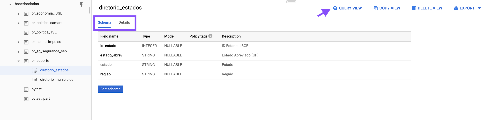

# Como usar via BigQuery

Em apenas 2 passos você consegue obter dados estruturados para baixar e
analisar:

1. Acessar o projeto no BigQuery
2. Realizar sua query para explorar os dados

## Acessando o projeto

!!! Info
    É preciso ter uma conta no Google Cloud Plataform (GCP). Ao clicar
    no botão abaixo você será redirecionado para logar na sua conta ou
    criar uma antes de acessar o projeto.

<a href="https://console.cloud.google.com/bigquery?p=basedosdados&page=project" title="{{ lang.t('source.link.title')}}" class="md-button">
    Clique para acessar o projeto no BigQuery
</a>

<!-- Uma vez logado, acesse o BigQuery no menu lateral de seu console


Para acessar o projeto no BigQuery, vá em `ADD DATA` e busque por
`basedosdados`.

{ width=100% }

Pronto! Agora você pode explorar todas as tabelas do projeto. -->


## Explorando os dados

**Quais os municípios *millennials* 🕶?** Rode a query e descubra
municípios criados nos anos 2000.

```sql
SELECT *
FROM `basedosdados.br_suporte.diretorio_municipios`
WHERE existia_2000 = 0;
```

## Estrutura do BigQuery

Dentro do projeto existem dois níveis de organização, <strong style="color:#007aa7">*datasets*</strong>
(conjuntos de dados) e <strong style="color:#4b00a7">*tables*</strong> (tabelas), nos quais:

- Todas as *tables* estão organizadas em *datasets*
- Cada *table* pertence a um único *dataset*

!!! Info
    Caso não apareçam as tabelas nos datasets do projeto,
    *atualize a página*.

{ width=100% }

As *tables* possuem uma estrutura definida em seu *schema*.
Ao clicar numa tabela você pode:

- Ver seu **schema**, incluindo o formato do dado e descrição de cada coluna
- Ver **detalhes de publicação** da mesma, incluindo a frequência de atualização, autor da
publicação e do tratamento dos dados.
- **Construir uma query para os dados**

{ width=100% }

### Construindo sua query

Clicando no botão `🔍 Query View`, o BigQuery cria automaticamente a estrutura básica
da sua query - basta você completar com os campos e filtros que achar necessários.

!!! Info
    O BigQuery utiliza SQL como linguagem nativa. Leia mais sobre a sintaxe
    utilizada
    [aqui](https://cloud.google.com/bigquery/docs/reference/standard-sql/query-syntax).
    
!!! Warning
    As queries são pagas, porém o **custo é praticamente zero para usuários**. São cobrados somente 5 dólares por TB de dados que sua query percorrer, e os primeiros 5 TB são gratuitos.