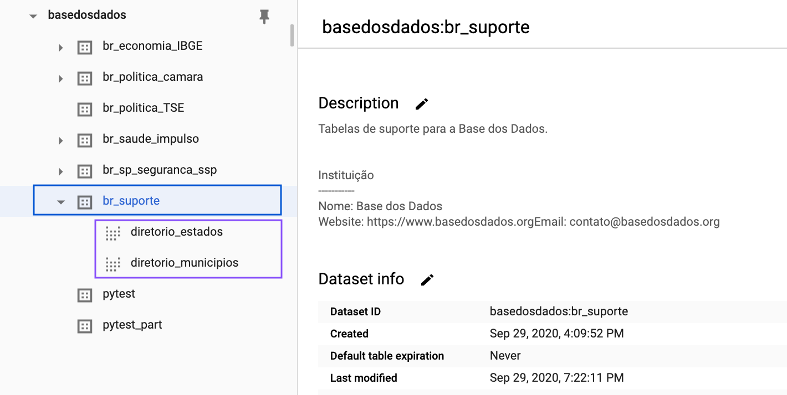
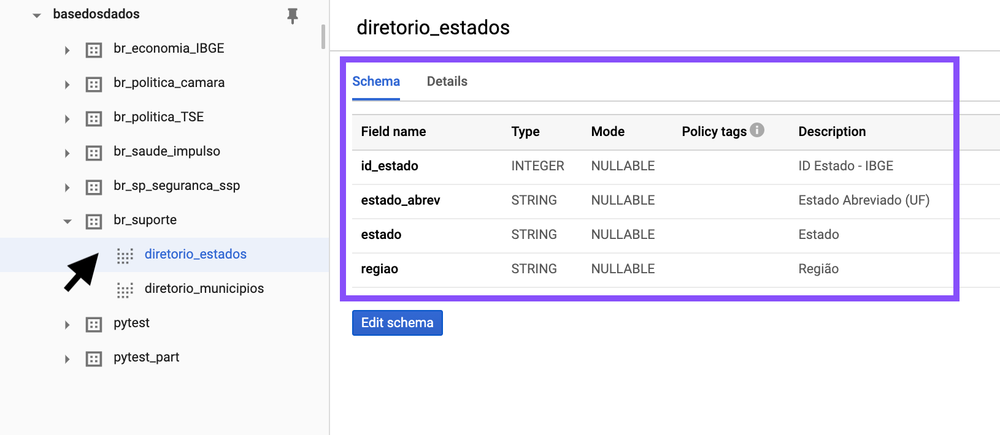
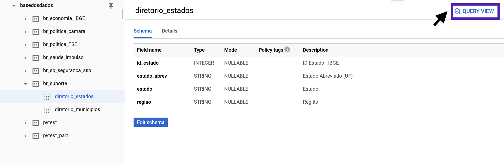

# Como usar via BigQuery

Basta acessar o projeto no BiqQuery e escrever sua query para explorar os dados.

## Acessando o projeto

!!! Info
    É preciso ter uma conta no Google Cloud Plataform (GCP). Ao clicar
    no botão abaixo você será redirecionado para logar na sua conta ou
    criar uma antes de acessar o projeto.

<a
href="https://console.cloud.google.com/bigquery?p=basedosdados&page=project"
title="{{ lang.t('source.link.title')}}" class="md-button"
style="background-color: var(--md-primary-fg-color);color:
var(--md-primary-bg-color);"
hover="background-color: var(--md-primary-fg-color--dark)">
    Clique para acessar o projeto no BigQuery
</a>

Dentro do projeto existem dois níveis de organização, <strong style="color:#007aa7">*datasets*</strong>
(conjuntos de dados) e <strong style="color:#4b00a7">*tables*</strong>
(tabelas), nos quais:

- Todas as *tables* estão organizadas em *datasets*
- Cada *table* pertence a um único *dataset*

!!! Tip
    Caso não apareçam as tabelas nos *datasets* do projeto, atualize a página.

{ width=100% }


## Explorando os dados

### Exemplo

!!! Tip
    **Quais os municípios *millennials* 🕶?** Rode a query e descubra
    municípios criados nos anos 2000.

```sql
SELECT *
FROM `basedosdados.br_suporte.diretorio_municipios`
WHERE existia_2000 = 0;
```

### Metadados

Clicando num *dataset* ou *table* você já consegue ver toda a estrutura
e descrição das colunas, e pode acessar também os detalhes de tratamento e publicação,
como frequência de atualização, autor da publicação e do tratamento dos dados.

{ width=100% }

### Buscando os dados

O BigQuery possui já um mecanismo de busca que permite buscar por nomes
de *datasets* (conjuntos), *tables* (tabelas) ou *labels* (grupos).

!!! Tip
    Construímos uma nomeclatura simples e prática para facilitar sua
    busca - veja como é essa estrutura [aqui](../naming_rules/).

### Construindo sua query

Clicando no botão `🔍 Query View`, o BigQuery cria automaticamente a estrutura básica
da sua query em `Query Editor` - basta você completar com os campos e filtros que achar
necessários.

{ width=100% }

!!! Info
    O BigQuery utiliza SQL como linguagem nativa. Leia mais sobre a
    sintaxe utilizada
    [aqui](https://cloud.google.com/bigquery/docs/reference/standard-sql/query-syntax).
