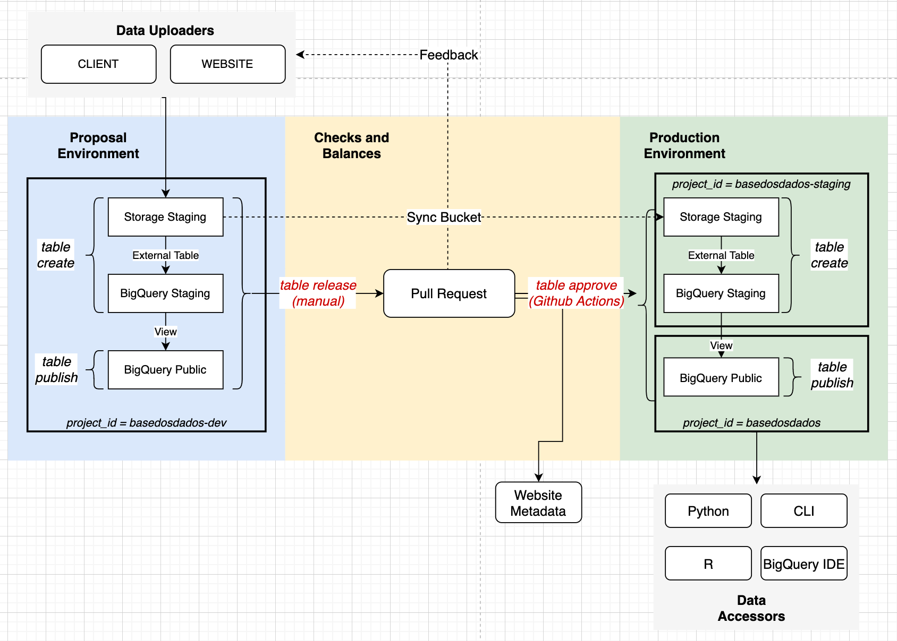

# Infraestrutura na BD+ - TODO: REVER TUDO AQUI!

O time de infraestrutura é responsável pelas ferramentas de ingestão de dados, 
que englobam desde o upload de dados até a disponibilização de dados no ambiente 
de produção (processo do azul ao verde); pelo acesso de dados através de pacotes 
em Python e R (canto inferior direito); e pelo website (canto superior esquerdo). 
Atualmente é possível colaborar em todas as frentes, com destaque ao 
desenvolvimento dos pesos e contrapesos e atualização do site. 

# Colaborando com a Infra - TODO: DETALHAR 1 PARAGRAFO PARA CADA TIPO DE COLABORAÇÃO

Você pode contribuir para nossa infraestrutura de várias formas:

* Melhorando a documentação
* Criando tutoriais e workshops
* Melhorando nossa API em R
* Melhorando nossa API em Python
* Melhorando nosso o UX do nosso site (React, CSS, HTML)
* Criando checagens automáticas de qualidade de dados e metadados (em Python)

!!! Tip "Sugerimos que entre em nosso [canal no Discord](https://discord.gg/huKWpsVYx4) para tirar dúvidas e interagir com outros(as) colaboradores(as)! :)"

## Qual o procedimento?

* Dar uma olhada nos issues abertos no nosso [Github](https://github.com/basedosdados/mais/issues) com o prefixo `[infra]`. Pegar um que te interesse e já pode começar a fazer!
* Criar issues novos com sugestões de _features_ e começar depois de ouvir uma avaliação do resto da comunidade.