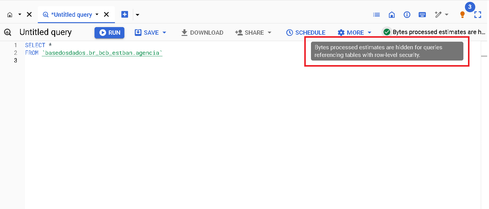

# BigQuery

O BigQuery é o um serviço de banco de dados em nuvem da
Google. Você faz consultas ao banco em SQL direto do navegador com:

- **Rapidez**: Mesmo queries muito longas demoram apenas minutos para serem processadas.

- **Escala**: O BigQuery escala magicamente para hexabytes se necessário.

- **Economia**: Todo usuário possui *1 TB gratuito por mês para consulta
  aos dados*.

Pronto(a) para começar? Nesta página você encontra:

- [Primeiros passos](#primeiros-passos)
- [Entenda o uso gratuito do Big Query BQ](#entenda-o-uso-gratuito-do-big-query-bq)
- [Tutoriais](#tutoriais)
- [Manuais e Cursos de SQL](#manuais-e-cursos-de-sql)

## Primeiros passos

### Antes de começar: Crie o seu projeto no Google Cloud

Para criar um projeto no Google Cloud basta ter um email cadastrado no
Google. É necessário ter um projeto seu, mesmo que vazio, para você
fazer queries em nosso *datalake* público.

1. **[Acesse o Google Cloud](https://console.cloud.google.com/projectselector2/home/dashboard)**.
   Caso for a sua primeira vez, aceite o Termo de Serviços.
3. **Clique em `Create Project/Criar Projeto`**. Escolha um nome bacana para o projeto.
5. **Clique em `Create/Criar`**

??? Info "Por que eu preciso criar um projeto no Google Cloud?"
    A Google fornece 1 TB gratuito por mês de uso do BigQuery para cada
    projeto que você possui. Um projeto é necessário para ativar os
    serviços do Google Cloud, incluindo a permissão de uso do BigQuery.
    Pense no projeto como a "conta" na qual a Google vai contabilizar o
    quanto de processamento você já utilizou. **Não é necessário adicionar
    nenhum cartão ou forma de pagamento - O BigQuery inicia automaticamente no modo Sandbox, que permite você utilizar seus recursos sem adicionar um modo de pagamento. [Leia mais aqui](https://cloud.google.com/bigquery/docs/sandbox/?hl=pt).**
    
### Acessando o datalake da `basedosdados`

O botão abaixo via te direcionar ao nosso projeto no Google BigQuery:

<a
href="https://console.cloud.google.com/bigquery?p=basedosdados&page=project"
title="{{ lang.t('source.link.title')}}" class="md-button"
hover="background-color: var(--md-primary-fg-color--dark)">
    Ir para BigQuery :material-arrow-right:
</a>

Agora você precisa fixar o projeto da BD no seu BigQuery, é bem simples, veja:

!!! Warning A opção **Fixar um projeto** pode aparccer também como **Marcar projeto com estrela por nome**


Dentro do projeto existem dois níveis de organização dos dados,
<strong>*datasets*</strong> (conjuntos de dados) e
<strong>*tables*</strong> (tabelas), nos quais:

- **Todas as tabelas estão organizadas dentro de cojuntos de dados**, que
  representaam sua organização/tema (ex: o conjunto
  `br_ibge_populacao` contém uma tabela `municipio` com a série
  histórica de população a
  nível municipal)
- **Cada tabela pertence a um único conjunto de dados** (ex: a tabela
  `municipio` em `br_ibge_populacao` é diferente de `municipio` em `br_bd_diretorios`)
  
!!! Tip "[Veja aqui o guia do Google de como funciona a interface do BigQuery](https://cloud.google.com/bigquery/docs/bigquery-web-ui)."

{ width=100% }

!!! Warning "Caso não apareçam as tabelas na 1ª vez que você acessar, atualize a página."

### Faça sua primeira consulta!

Que tal fazer uma consulta simples? Vamos usar o *Editor de Consultas do
BigQuery* para ver as informações sobre municípios direto na nossa base de diretórios brasileiros. Para isso,
copiar e colar o código abaixo:

```sql
SELECT * FROM `basedosdados.br_bd_diretorios_brasil.municipio`
```

Só clicar em **Executar** e pronto!

{ width=100% }

!!! Tip "Dica"
    Clicando no botão `🔍 Consultar tabela/Query View`, o BigQuery cria
    automaticamente a estrutura básica da sua query em `Query Editor/Editor
    de consultas` - basta você completar com os campos e filtros que
    achar necessários.

## Entenda o uso gratuito do Big Query BQ

Está seção é dedicada a apresentar dicas de como reduzir custos de processamento para aproveitar ao máximo os dados da BD! 

Para usuários que acessam os dados em projetos públicos como o da Base dos Dados o único tipo de custo associado se refere ao custo de **processamento das consultas**. A notícia boa, como mencionado acima, é que todo usuário possui *1 TB gratuito por mês para consultar livremente os dados do maior data lake público do Brasil*. Se você ainda não possui um projeto no BQ consulte [a sessão acima](https://basedosdados.github.io/mais/access_data_bq/#primeiros-passos) para criá-lo.

- Conhecer o básico da interface do BQ é importante para o entendimento do artigo. Caso você não tenha familiariadade ou queria revisitar a interface, sugerimos 3 trilhas:
1. Nosso guia utilizando as [tabelas da RAIS - Relação Anual de Informações Sociais](https://dev.to/basedosdados/bigquery-101-45pk) 
2. Nosso acervo de [vídeos no youtube](https://www.youtube.com/@BasedosDados)
3. A introdução a interface [feita pelo Google](https://cloud.google.com/bigquery/docs/bigquery-web-ui?hl=pt-br#open-ui)


### Veja como usufruir ao máximo das consultas gratuitas

Nesta seção, apresentamos algumas dicas simples para reduzir os custos das consultas no Big Query e aproveitar ao máximo os dados da BD! Antes de partir para os exemplos, apresentaremos o mecanismo básico de previsão de custos de processamento de consultas no Big Query (BQ). 

!!! Tip "Estimativas de custos"
  No canto superior direito da interface do BQ é informado um aviso com estimativa do custo de processamento que será cobrado do seu projeto apos a execução da consulta.
  
  { width=100% }


- Este é o mecanismo básico e prontamente acessível de previsibilidade dos custos de processamento. Infelizmente, não funciona para todas as tabelas. Por motivos de limitação interna do próprio Big Query, consultas à tabelas específicas não exibem estimativas de custos. É o caso das tabelas que possuem **Row Access Policy**. Isto é, tabelas onde o número de linhas acessíveis é limitada a depender do usuário. Este é o caso das tabelas que fazem parte do serviço [BDpro](https://info.basedosdados.org/bd-pro)

- Exemplo da tabela `agencia` do conjunto `br_bcb_estban`. 
  
   { width=100% }


### DICA 1: **Selecione somente as colunas de interesse**
	
- A arquitetura do Big Query utiliza o armazenamento orientado a colunas, isto é, cada coluna é armazenada separadamente. Esta característica tem uma implicação clara quanto aos custos de processamento: **quanto mais colunas forem selecionadas, maior será o custo.**
	

- **Evite**: Selecionar colunas em excesso

```sql 
    SELECT * 
```

- **Prática recomendada**: selecione somente as colunas de interesse para reduzir o custo final da consulta.

```sql
SELECT coluna1, coluna2 
```
- Veja este a diferença obtida com a tabela [`microdados`](https://basedosdados.org/dataset/5beeec93-cbf3-43f6-9eea-9bee6a0d1683?table=dea823a5-cad7-4014-b77c-4aa33b3b0541) do conjunto `br_ms_sim`.

  - **Sem seleção de colunas:** custo estimado 5.83 GB
  - **Selecionando 3 colunas:** custo estimado 0.531 GB (531 MB)

```sql
SELECT sequencial_obito, tipo_obito, data_obito FROM `basedosdados.br_ms_sim.microdados`
``` 

	
- Para entender mais a fundo a arquitetura colunar, consulte a documentação oficial do [Big Query](https://cloud.google.com/bigquery/docs/storage_overview?hl=pt-br)

### DICA 2: Utilize colunas particionadas e clusterizadas para filtrar os dados

-  As partições são divisões feitas em uma tabela para facilitar o gerenciamento e a consulta dos dados. No momento de execução da consulta, o Big Query ignora linhas que possuem um valor da partição diferente do utilizado no filtro. Isto normalmente reduz significativamente a quantidade de linhas lidas e, o que nos interessa, **reduz o custo de processamento**.

- Clusters são agrupamentos organizados em uma tabela com base nos valores de uma ou mais colunas especificadas. Durante a execução de uma consulta, o BigQuery otimiza a leitura dos dados, acessando apenas os segmentos que contêm os valores relevantes das colunas de cluster. Isso significa que, ao invés de escanear toda a tabela, apenas as partes necessárias são lidas, o que geralmente reduz a quantidade de dados processados e, consequentemente, **reduz o custo de processamento.**

- Como saber qual coluna foi utilizada para particionar e clusterizar uma tabela específica?

  1. Pelos metadados na página de tabela no site da [BD](https://basedosdados.org/dataset/5beeec93-cbf3-43f6-9eea-9bee6a0d1683?table=dea823a5-cad7-4014-b77c-4aa33b3b0541)

  

  - Note que o campo **Partições no Big Query** elenca tanto as partições quanto os clusters.

  2. Pelos metadados na página de 'Detalhes' no Big Query
  
  

  - Note que são elencadas ambas informações: **partições** e **clusters**. Neste caso, a coluna **ano** foi definida como partição e a coluna **sigla_uf** como cluster.  

- **Prática recomendada**: sempre que possível, utilize colunas particionadas e clusterizadas para filtrar/agregar os dados.

- **Exemplo**
  -  Consulta utilizado a coluna particionada como filtro:
```sql
SELECT sequencial_obito, tipo_obito, data_obito FROM `basedosdados.br_ms_sim.microdados` where ano = 2015
```
  - **custo estimado**: 31.32 MB. A combinação de técnicas de seleção de colunas e filtro utilizando partição **reduziu o custo** estimado da consulta inicial de **5.83 GB** para somente **31.32 MB**

### DICA 3: Muita atenção ao realizar joins entre tabelas

- **Avalie a real necessidade do JOIN**
  - Certifique-se de que o join é realmente necessário para a análise que você está realizando. Às vezes, operações alternativas como subconsultas ou agregações podem ser mais eficientes.

- **Entenda a Lógica do JOIN**
  - Diferentes tipos de joins (INNER, LEFT, RIGHT, FULL) têm diferentes implicações de desempenho e resultado. Gastar um tempinho entendo a melhor opção para seu objetivo de análise pode ajudar a ter um controle de custos mais eficiente. 
  - Um dos problemas mais comuns é a multiplicação de linhas indesejadas no resultado final. 
  - Para entender a fundo boas práticas e problemas recorrentes com joins sugerimos os guias [SQL Joins na prática](https://medium.com/@aneuk3/sql-joins-defcf817e8cf) e [Maximizando a Eficiência com JOIN em Consultas SQL para Combinar Tabelas](https://medium.com/comunidadeds/maximizando-a-eficiência-com-join-em-consultas-sql-para-combinar-tabelas-55bd3b62fa09) 

- **Utilize as dicas anteriores**
  - Selecione somente colunas de interesse
  - Faça uso das colunas particionadas para filtrar os dados
  - Atente-se a estimativa de custos antes de executar a consulta


## Tutoriais

### Como navegar pelo BigQuery

Para entender mais sobre a interface do BigQuery e como explorar os
dados, preparamos um texto completo no blog com um exemplo de busca dos
dados da [RAIS - Ministério da Economia](https://dev.to/basedosdados/bigquery-101-45pk).

*Cansado(a) da leitura? Temos também um [vídeo completo no nosso Youtube](https://www.youtube.com/watch?v=nGM2OwTUY_M&t=1285s).*

### Entenda os dados

O BigQuery possui um mecanismo de busca que permite buscar por nomes
de *datasets* (conjuntos), *tables* (tabelas) ou *labels* (grupos).
Construímos regras de nomeação simples e práticas para facilitar sua
busca - [veja mais](../style_data).

### Entenda o uso gratuito do Big Query (BQ)

### Conectando com o PowerBI

O Power BI é uma das tecnologias mais populares para o desenvolvimento
de dashboards com dados relacionais. Por isso, preparamos um tutorial
para você descobrir [como usar os dados do *datalake* no desenvolvimento dos seus dashboards](https://dev.to/basedosdados/tutorial-power-bi-j6d).

### Manuais e Cursos de SQL

Está começando a aprender sobre SQL para fazer suas consultas? Abaixo
colocamos algumas recomendações usadas pela nossa equipe tanto no
aprendizado quanto no dia-a-dia:

- [Lista de funções em SQL da W3](https://www.w3schools.com/sql/default.Asp)
- [Curso SQL na Codeacademy](https://www.codecademy.com/learn/learn-sql)
- [Curso de SQL do Programação Dinâmica](https://www.youtube.com/watch?v=z32438Yehl4&list=PL5TJqBvpXQv5n1N15kcK1m9oKJm_cv-m6&index=2)
