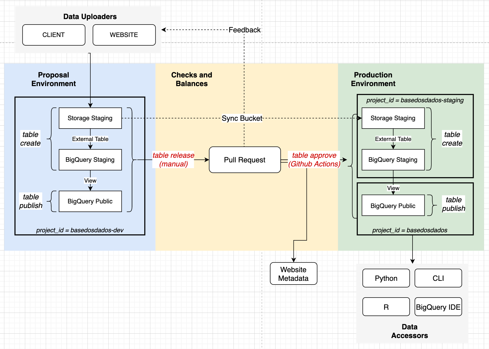

# Infra da BD

Nosso time de infraestrutura cuida para que todos os pacotes e pipelines
estejam funcionando da melhor forma para o público. Utilizamos o Github
para gerir todo o código e mantê-lo organizado, onde você pode encontrar
issues de novas features, bugs e melhorias que estamos trabalhando.
## Como funciona nossa infraestrutura

Nossa infraestrutura é composta de 3 frentes principais:

- [**Sistema de ingestão de dados**](#sistema-de-ingestao-de-dados): desde o upload até a
  disponibilização em produção;
- [**Pacotes de acesso**](#pacotes-de-acesso)
- [**Website**](#website): Front-end, Back-end e APIs.

Atualmente é possível colaborar em todas as frentes, com destaque ao
desenvolvimento dos pesos e contrapesos e atualização do site.

!!! Tip "Sugerimos que entre em nosso [canal no Discord](https://discord.gg/huKWpsVYx4) para tirar dúvidas e interagir com outros(as) colaboradores(as)! :)"

## Sistema de ingestão de dados

O sistema possui ambientes de desenvolvimento
(`basedosdados-dev`), homologação (`basedosdados-staging`) e produção
(`basedosdados`) no BigQuery. Os processos para subida de dados são
detalhados na imagem abaixo, sendo alguns deles automatizados
via Github Actions.

Explicamos com mais detalhes do funcionamento desse sistema [no blog](https://dev.to/basedosdados/como-funciona-o-sistema-de-insercao-de-dados-na-bd-25dk).

### Como contribuir?

- Melhorando a documentação do sistema aqui :)
- [Criando checagens automáticas de qualidade de dados e metadados (em Python)](https://github.com/basedosdados/mais/issues/376)
- [Criando novos issues e sugestões de melhorias](https://github.com/basedosdados/mais/issues/new/choose)

## Pacotes de acesso

Os pacotes de acesso ao *datalake* estão em constante melhoria e você
pode colaborar com a gente com novas features, conserto de bugs e muito
mais.

### Como contribuir?

- [Explore os issues do pacote Python](https://github.com/basedosdados/mais/labels/python)
- [Explore os issues do pacote R](https://github.com/basedosdados/mais/labels/R)
- [Ajude a desenvolver o pacote em Stata](https://github.com/basedosdados/mais/pull/754)

## Website

Nosso website é desenvolvido em
[Next.js](https://nextjs.org/learn/basics/create-nextjs-app) e consome
uma API de metadados do CKAN. O código do site está também no nosso [Github](https://github.com/basedosdados/website).

### Como contribuir?

- [Melhore o UX do site (Next, CSS, HTML)](https://github.com/basedosdados/website#editando-html)
- [Ajudando em issues abertas de BE, FE ou API](https://github.com/basedosdados/website/issues)
- [Criando novos issues e sugestões de melhorias](https://github.com/basedosdados/website/issues/new)
