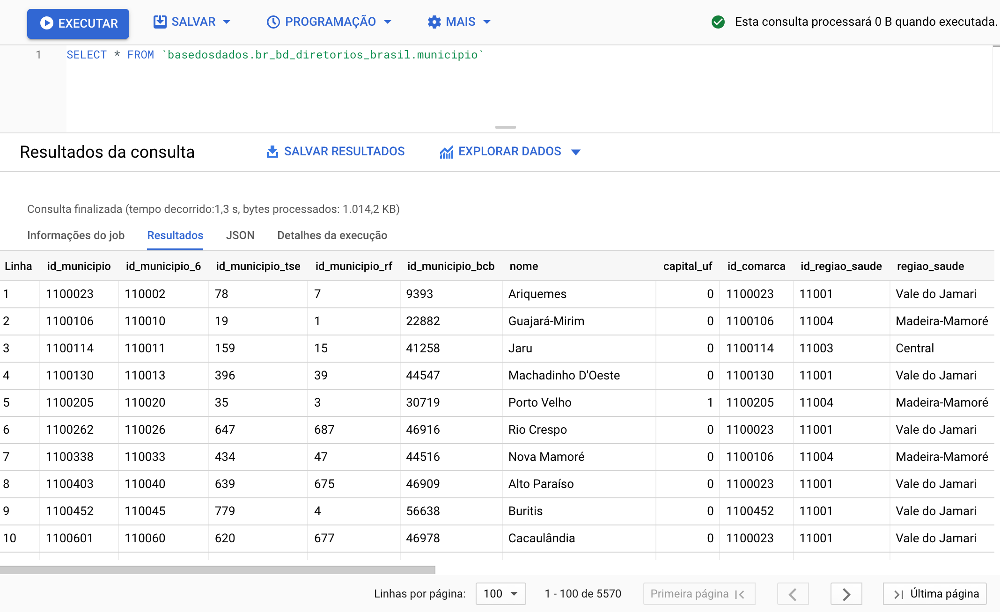

# BigQuery

BigQuery is Google's cloud database service. You can query the database using SQL directly in your browser with:

- **Speed**: Even very long queries take only minutes to process.

- **Scale**: BigQuery magically scales to hexabytes if needed.

- **Economy**: Every user gets *1 TB free per month for querying data*.

Ready to start? On this page you'll find:

- [Getting Started](#getting-started)
- [Understanding BigQuery's Free Usage](#understanding-bigquerys-free-usage)
- [Tutorials](#tutorials)
- [SQL Manuals and Courses](#sql-manuals-and-courses)

## Getting Started

### Before starting: Create your Google Cloud project

To create a Google Cloud project, you just need an email registered with Google. You need to have your own project, even if empty, to make queries in our public *datalake*.

1. **[Access Google Cloud](https://console.cloud.google.com/projectselector2/home/dashboard)**.
   If it's your first time, accept the Terms of Service.
3. **Click on `Create Project`**. Choose a nice name for the project.
5. **Click on `Create`**

??? Info "Why do I need to create a Google Cloud project?"
    Google provides 1 TB free per month of BigQuery usage for each project you own. A project is necessary to activate Google Cloud services, including BigQuery usage permission. Think of the project as the "account" where Google will track how much processing you've already used. **You don't need to add any card or payment method - BigQuery automatically starts in Sandbox mode, which allows you to use its resources without adding a payment method. [Read more here](https://cloud.google.com/bigquery/docs/sandbox/?hl=en).**
    
### Accessing the `basedosdados` datalake

The button below will direct you to our project in Google BigQuery:

<a
href="https://console.cloud.google.com/bigquery?p=basedosdados&page=project"
title="{{ lang.t('source.link.title')}}" class="md-button"
hover="background-color: var(--md-primary-fg-color--dark)">
    Go to BigQuery :material-arrow-right:
</a>

Now you need to pin the DB project in your BigQuery, it's quite simple, see:

!!! Warning The **Pin a project** option may also appear as **Star project by name**


Within the project there are two levels of data organization,
<strong>*datasets*</strong> and <strong>*tables*</strong>, where:

- **All tables are organized within datasets**, which represent their organization/theme (e.g., the dataset `br_ibge_populacao` contains a `municipio` table with the historical population series at municipal level)
- **Each table belongs to a single dataset** (e.g., the `municipio` table in `br_ibge_populacao` is different from `municipio` in `br_bd_diretorios`)
  
!!! Tip "[See Google's guide on how the BigQuery interface works here](https://cloud.google.com/bigquery/docs/bigquery-web-ui)."

{ width=100% }

!!! Warning "If tables don't appear the first time you access, refresh the page."

### Make your first query!

How about making a simple query? Let's use the *BigQuery Query Editor* to see information about municipalities directly in our Brazilian directories database. To do this, copy and paste the code below:

```sql
SELECT * FROM `basedosdados.br_bd_diretorios_brasil.municipio`
```

Just click **Run** and you're done!

{ width=100% }

!!! Tip "Tip"
    By clicking the `🔍 Query Table` button, BigQuery automatically creates
    the basic structure of your query in the `Query Editor` - you just need to complete it with the fields and filters you find necessary.

## Understanding BigQuery's Free Usage

This section is dedicated to presenting tips on how to reduce processing costs to maximize the data from BD! 

For users who access data in public projects like the BD, the only type of cost associated is the cost of **processing queries**. The good news, as mentioned above, is that every user gets *1 TB free per month for querying data*. If you still don't have a project in BQ, consult [the section above](#getting-started) to create one.

- Knowing the basics of the BQ interface is important for understanding the article. If you don't have familiariadade or want to revisit the interface, we recommend 3 tracks:
1. Our guide using the [RAIS - Annual Relation of Information Society](https://dev.to/basedosdados/bigquery-101-45pk) tables 
2. Our collection of [videos on YouTube](https://www.youtube.com/@BasedosDados)
3. The introduction to the interface [done by Google](https://cloud.google.com/bigquery/docs/bigquery-web-ui?hl=en#open-ui)


### See how to maximize the benefits of free queries

In this section, we present some simple tips to reduce the costs of queries in Big Query and maximize the data from BD! Before moving on to the examples, we'll introduce the basic mechanism for predicting query processing costs in Big Query (BQ). 

!!! Tip "Cost estimates"
  In the upper right corner of the BQ interface, there's a notice with an estimate of the processing cost that will be charged to your project after the query execution.
  
  { width=100% }


- This is the basic and readily accessible mechanism for predictability of processing costs. Unfortunately, it doesn't work for all tables. Due to limitations within Big Query itself, queries to specific tables don't display cost estimates. This is the case of tables with **Row Access Policy**. This means that the number of accessible rows is limited depending on the user. This is the case of tables that are part of the [BD Pro](https://info.basedosdados.org/en/bd-pro) service

- Example of the `agencia` table from the `br_bcb_estban` dataset. 
  
   { width=100% }


### TIP 1: **Select only the columns of interest**
	
- The Big Query architecture uses column-oriented storage, meaning that each column is stored separately. This characteristic has a clear implication regarding processing costs: **the more columns are selected, the higher the cost.**
	

- **Avoid**: Selecting too many columns

```sql 
    SELECT * 
```

- **Recommended practice**: select only the columns of interest to reduce the final cost of the query.

```sql
SELECT coluna1, coluna2 
```
- See the difference obtained with the table [`microdados`](https://basedosdados.org/en/dataset/5beeec93-cbf3-43f6-9eea-9bee6a0d1683?table=dea823a5-cad7-4014-b77c-4aa33b3b0541) from the `br_ms_sim` set.

  - **Without column selection:** estimated cost 5.83 GB
  - **Selecting 3 columns:** estimated cost 0.531 GB (531 MB)

```sql
SELECT sequencial_obito, tipo_obito, data_obito FROM `basedosdados.br_ms_sim.microdados`
``` 

	
- To understand the columnar architecture in depth, consult the official [Big Query](https://cloud.google.com/bigquery/docs/storage_overview?hl=en#open-ui) documentation

### TIP 2: Use partitioned and clustered columns to filter data

- Partitions are divisions made in a table to facilitate data management and query. During query execution, Big Query ignores rows that have a partition value different from the one used in the filter. This usually significantly reduces the number of rows read and, what we're interested in, **reduces the processing cost.**

- Clusters are organized groups in a table based on the values of one or more specified columns. During query execution, Big Query optimizes data reading, accessing only the segments that contain the relevant values of the cluster columns. This means that instead of scanning the entire table, only the necessary parts are read, which generally reduces the amount of processed data and, consequently, **reduces the processing cost.**

- How to know which column was used to partition and cluster a specific table?

  1. By the metadata on the table page on the BD website

  

  - Note that the **Partitions in Big Query** lists both partitions and clusters.

  2. By the metadata on the 'Details' page in Big Query
  
  

  - Note that both **partitions** and **clusters** are listed. In this case, the column **ano** was defined as a partition and the column **sigla_uf** as a cluster.  

- **Recommended practice**: always try to use partitioned and clustered columns to filter/aggregate data.

- **Example**
  -  Query used with a partitioned column as a filter:
```sql
SELECT sequencial_obito, tipo_obito, data_obito FROM `basedosdados.br_ms_sim.microdados` where ano = 2015
```
  - **estimated cost**: 31.32 MB. The combination of column selection techniques and filtering using partition **reduced the estimated cost** from the initial query of **5.83 GB** to only **31.32 MB**

### TIP 3: Pay close attention when performing joins between tables

- **Evaluate the real need for JOIN**
    - Make sure the join is really necessary for the analysis you're performing. Sometimes, alternative operations like subqueries or aggregations can be more efficient.

- **Understand the JOIN logic**
    - Different types of joins (INNER, LEFT, RIGHT, FULL) have different implications for performance and result. Taking a moment to understand the best option for your analysis goal can help you have more efficient cost control. 
    - One of the most common problems is the multiplication of unwanted rows in the final result. 
    - To understand the full picture of good practices and common issues with joins, we recommend the guides [SQL Joins in Practice](https://medium.com/@aneuk3/sql-joins-defcf817e8cf) and [Maximizing Efficiency with JOIN in SQL Queries to Combine Tables](https://medium.com/comunidadeds/maximizando-a-eficiência-com-join-em-consultas-sql-para-combinar-tabelas-55bd3b62fa09) 

- **Use the tips above**
    - Select only the columns of interest
    - Use the partitioned columns to filter the data
    - Pay attention to cost estimates before executing the query


## Tutorials

### How to navigate BigQuery

To understand more about the BigQuery interface and how to explore the data, we prepared a complete text in the blog with an example of searching for data from the [RAIS - Ministry of Economy](https://dev.to/basedosdados/bigquery-101-45pk).

*Tired of reading? We also have a [complete video on our YouTube](https://www.youtube.com/watch?v=nGM2OwTUY_M&t=1285s).*

### Understand the data

BigQuery has a search mechanism that allows you to search by *datasets* (sets), *tables* (tables), or *labels* (groups).
We created simple naming rules and practices to facilitate your search - [see more](style_data.md).

### Understand the use of BigQuery (BQ) for free

### Connecting with PowerBI

Power BI is one of the most popular technologies for developing dashboards with relational data. That's why we prepared a tutorial for you to discover [how to use the *datalake* data in the development of your dashboards](https://dev.to/basedosdados/tutorial-power-bi-j6d).

### SQL Manuals and Courses

We're starting to learn about SQL to make our queries? Below we provide some recommendations used by our team both in learning and in everyday life:

- [List of SQL functions in W3](https://www.w3schools.com/sql/default.Asp)
- [SQL Course on Codeacademy](https://www.codecademy.com/learn/learn-sql)
- [SQL Course from Dynamic Programming](https://www.youtube.com/watch?v=z32438Yehl4&list=PL5TJqBvpXQv5n1N15kcK1m9oKJm_cv-m6&index=2)
