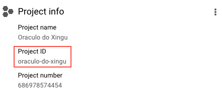

# Packages

Data Basis' packages allow access to the public *datalake*
directly from your computer or development environment. Currently available in:

- **:material-language-python: Python**
- **:material-language-r: R**
- **Stata**
- **:octicons-terminal-16: CLI (terminal)**

Ready to start? On this page you'll find:

- [Getting started](#getting-started)
- [Tutorials](#tutorials)
- [Reference manuals](#reference-manuals-api)

## Getting started

### Before starting: Create your Google Cloud project

To create a Google Cloud project, you just need an email registered with
Google. You need to have your own project, even if empty, to
make queries in our public *datalake*.

1. **[Access Google Cloud](https://console.cloud.google.com/projectselector2/home/dashboard)**.
   If it's your first time, accept the Terms of Service.
2. **Click on `Create Project`**. Choose a nice name for the project.
3. **Click on `Create`**

??? Info "Why do I need to create a Google Cloud project?"
    Google provides 1 TB free per month of BigQuery usage for each
    project you own. A project is necessary to activate Google Cloud
    services, including BigQuery usage permission.
    Think of the project as the "account" in which Google will track how
    much processing you have already used. **You don't need to add
    any card or payment method - BigQuery automatically starts in Sandbox mode, which allows you to use its resources without adding a payment method. [Read more here](https://cloud.google.com/bigquery/docs/sandbox/).**

### Installing the package

To install the package in Python and command line, you can use
`pip` directly from your terminal. In R, you can install directly in
RStudio or
editor of your preference.

=== "**Python/CLI**"
    ```bash
    pip install basedosdados
    ```

=== "**R**"
    ```R
    install.packages("basedosdados")
    ```

=== "**Stata**"

Requerimentos:

1. Ensure your Stata is __version 16+__
2. Ensure Python is installed on your computer.

Once the requirements are met, run the following commands:

```stata
net install basedosdados, from("https://raw.githubusercontent.com/basedosdados/mais/master/stata-package")
```

### Configuring the package

Once you have your project, you need to configure the package to use the ID
of that project in queries to the *datalake*. To do this, you must use the
`project_id` that Google provides for you when the
project is created.



=== "Python/CLI"
    *You don't need to configure the project beforehand. As soon as you
    run your first query, the package will indicate the steps to configure.*

=== "R"
    *Once you have the `project_id`, you must pass this information to the package using the `set_billing_id` function.*
    ```R
    set_billing_id("<YOUR_PROJECT_ID>")
    ```

=== "Stata"
    *You need to specify the `project_id` every time you use the package.*


### Make your first query

A simple example to start exploring the *datalake* is to pull information
cadastral of municipalities directly from our base of [Brazilian Directories (table `municipio`)](https://basedosdados.org/dataset/br-bd-diretorios-brasil). To do this, we will use the
function `download`, downloading the data directly to our machine.

=== "Python"
    ```python
    import basedosdados as bd
    bd.download(savepath="<PATH>",
    dataset_id="br-bd-diretorios-brasil", table_id="municipio")
    ```

    *To understand more about the `download` function, read the [reference manual](../api_reference_python).*

=== "R"
    ```R
    library("basedosdados")
    query <- "SELECT * FROM `basedosdados.br_bd_diretorios_brasil.municipio`"
    dir <- tempdir()
    data <- download(query, "<PATH>")
    ```

    *To understand more about the `download` function, read the [reference manual](../api_reference_r).*

=== "Stata"
    ```stata
    bd_read_sql, ///
        path("<PATH>") ///
        query("SELECT * FROM `basedosdados.br_bd_diretorios_brasil.municipio`") ///
        billing_project_id("<PROJECT_ID>")
    ```

=== "CLI"
    ```bash
    basedosdados download "where/to/save/file" \
    --billing_project_id <YOUR_PROJECT_ID> \
    --query 'SELECT * FROM
    `basedosdados.br_bd_diretorios_brasil.municipio`'
    ```
    *To understand more about the `download` function, read the [reference manual](../api_reference_cli).*

## Tutorials

### How to use the packages

We prepared tutorials presenting the main functions of each package
for you to start using them.

=== "**Python**"
    Blog:

    - [Introduction to the Python package](https://dev.to/basedosdados/base-dos-dados-python-101-44lc)
    - [Introduction to the Python package (cont.)](https://dev.to/basedosdados/base-dos-dados-python-102-50k0)

    Vídeos:

    - [Workshop: Python applications](https://www.youtube.com/watch?v=wI2xEioDPgM)

=== "**R**"
    Blog:

    - [Introduction to the R package](https://dev.to/basedosdados/como-usar-a-biblioteca-basedosdados-no-r-capitulo-1-46kb)
    - [Exploring the Brazilian School Census](https://dev.to/basedosdados/explorando-o-censo-escolar-com-a-base-dos-dados-1a89)
    - [Brazil in the Olympics](https://dev.to/basedosdados/o-brasil-nas-olimpiadas-2g6n)

    Vídeos:

    - [Workshop: Learn how to access public data in R](https://www.youtube.com/watch?v=M9ayiseIjvI&t=250s)

=== "**Stata**"
    Documentation:

    - [GitHub](https://github.com/basedosdados/mais/tree/master/stata-package)

## Reference manuals (API)

* [:material-language-python: Python](../api_reference_python)
* [:material-language-r: R](../api_reference_r)
* [Stata](../api_reference_stata)
* [:octicons-terminal-16: CLI](../api_reference_cli)
