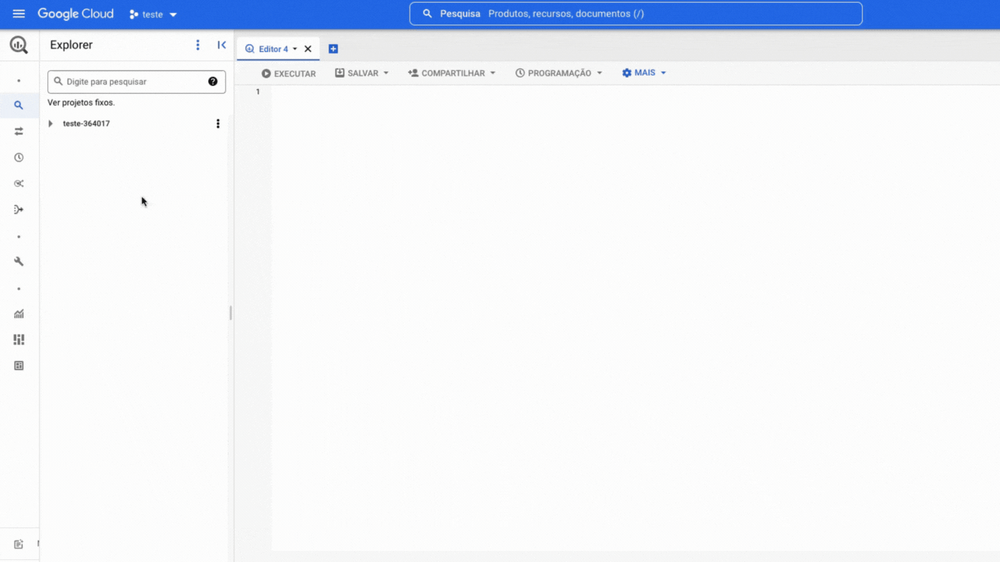
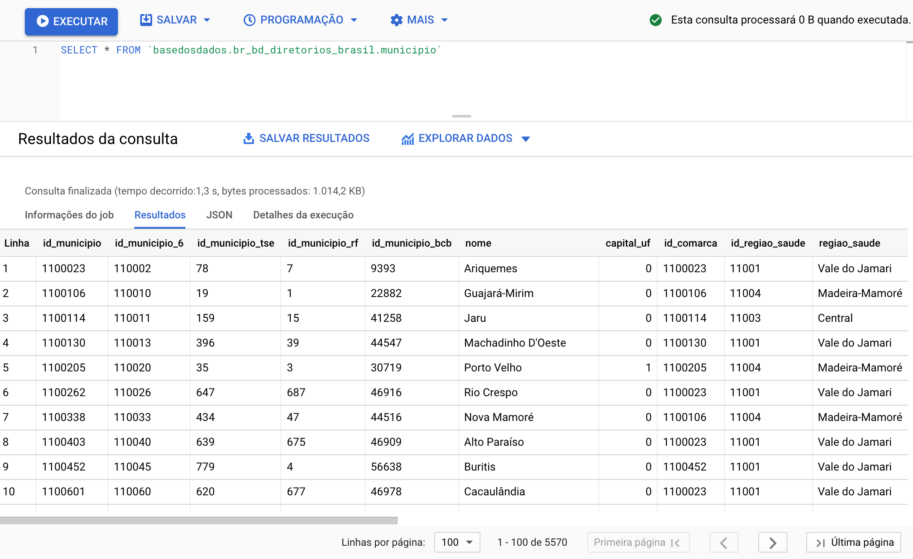
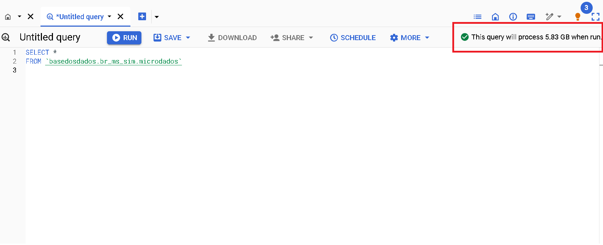

# BigQuery

BigQuery es el servicio de base de datos en la nube de Google. Puedes hacer consultas a la base de datos en SQL directamente desde el navegador con:

- **Rapidez**: Incluso las consultas muy largas tardan solo minutos en procesarse.

- **Escala**: BigQuery escala mágicamente a hexabytes si es necesario.

- **Economía**: Cada usuario tiene *1 TB gratuito por mes para consultar
  los datos*.

¿Listo(a) para empezar? En esta página encontrarás:

- [Primeros pasos](#primeros-pasos)
- [Entiende el uso gratuito de Big Query BQ](#entiende-el-uso-gratuito-de-big-query-bq)
- [Tutoriales](#tutoriales)
- [Manuales y Cursos de SQL](#manuales-y-cursos-de-sql)

## Primeros pasos

### Antes de empezar: Crea tu proyecto en Google Cloud

Para crear un proyecto en Google Cloud solo necesitas tener un correo registrado en
Google. Es necesario tener un proyecto propio, aunque esté vacío, para poder
hacer consultas en nuestro *datalake* público.

1. **[Accede a Google Cloud](https://console.cloud.google.com/projectselector2/home/dashboard)**.
   Si es tu primera vez, acepta los Términos de Servicio.
3. **Haz clic en `Create Project/Crear Proyecto`**. Elige un nombre atractivo para el proyecto.
5. **Haz clic en `Create/Crear`**

??? Info "¿Por qué necesito crear un proyecto en Google Cloud?"
    Google proporciona 1 TB gratuito por mes de uso de BigQuery para cada
    proyecto que posees. Un proyecto es necesario para activar los
    servicios de Google Cloud, incluyendo el permiso de uso de BigQuery.
    Piensa en el proyecto como la "cuenta" en la que Google contabilizará cuánto
    procesamiento has utilizado. **No es necesario agregar
    ninguna tarjeta o forma de pago - BigQuery inicia automáticamente en modo Sandbox, que te permite utilizar sus recursos sin agregar un método de pago. [Lee más aquí](https://cloud.google.com/bigquery/docs/sandbox/?hl=es).**
    
### Accediendo al datalake de `Base de los Datos`

El botón de abajo te dirigirá a nuestro proyecto en Google BigQuery:

<a
href="https://console.cloud.google.com/bigquery?p=basedosdados&page=project"
title="{{ lang.t('source.link.title')}}" class="md-button"
hover="background-color: var(--md-primary-fg-color--dark)">
    Ir a BigQuery :material-arrow-right:
</a>

Ahora necesitas fijar el proyecto de BD en tu BigQuery, es muy simple, mira:

!!! Warning La opción **Fijar un proyecto** puede aparecer también como **Marcar proyecto con estrella por nombre**



Dentro del proyecto existen dos niveles de organización de los datos,
<strong>*datasets*</strong> (conjuntos de datos) y
<strong>*tables*</strong> (tablas), en los cuales:

- **Todas las tablas están organizadas dentro de conjuntos de datos**, que
  representan su organización/tema (ej: el conjunto
  `br_ibge_populacao` contiene una tabla `municipio` con la serie
  histórica de población a
  nivel municipal)
- **Cada tabla pertenece a un único conjunto de datos** (ej: la tabla
  `municipio` en `br_ibge_populacao` es diferente de `municipio` en `br_bd_diretorios_brasil`)
  
!!! Tip "[Mira aquí la guía de Google sobre cómo funciona la interfaz de BigQuery](https://cloud.google.com/bigquery/docs/bigquery-web-ui)."

{ width=100% }

!!! Warning "Si no aparecen las tablas la primera vez que accedes, actualiza la página."

### ¡Haz tu primera consulta!

¿Qué tal hacer una consulta simple? Vamos a usar el *Editor de Consultas de
BigQuery* para ver la información sobre municipios directamente en nuestra base de directorios brasileños. Para esto,
copia y pega el código siguiente:

```sql
SELECT * FROM `basedosdados.br_bd_diretorios_brasil.municipio`
```

¡Solo haz clic en **Ejecutar** y listo!

{ width=100% }

!!! Tip "Consejo"
    Haciendo clic en el botón `🔍 Consultar tabla/Query View`, BigQuery crea
    automáticamente la estructura básica de tu consulta en `Query Editor/Editor
    de consultas` - solo necesitas completar con los campos y filtros que
    consideres necesarios.

## Entiende el uso gratuito de Big Query BQ

Esta sección está dedicada a presentar consejos sobre cómo reducir costos de procesamiento para aprovechar al máximo los datos de BD.

Para usuarios que acceden a los datos en proyectos públicos como el de Base de los Datos, el único tipo de costo asociado se refiere al costo de **procesamiento de las consultas**. La buena noticia, como se mencionó arriba, es que cada usuario tiene *1 TB gratuito por mes para consultar libremente los datos del mayor data lake público de Brasil*. Si aún no tienes un proyecto en BQ, consulta [la sección anterior](access_data_bq/#primeros-pasos) para crearlo.

- Conocer lo básico de la interfaz de BQ es importante para entender el artículo. Si no estás familiarizado o quieres revisar la interfaz, sugerimos 3 rutas:
1. Nuestra guía utilizando las [tablas de RAIS - Relación Anual de Informaciones Sociales](https://dev.to/basedosdados/bigquery-101-45pk) 
2. Nuestro acervo de [videos en YouTube](https://www.youtube.com/@BasedosDados)
3. La introducción a la interfaz [hecha por Google](https://cloud.google.com/bigquery/docs/bigquery-web-ui?hl=es)

### Ve cómo aprovechar al máximo las consultas gratuitas

En esta sección, presentamos algunos consejos simples para reducir los costos de las consultas en Big Query y ¡aprovechar al máximo los datos de BD! Antes de pasar a los ejemplos, presentaremos el mecanismo básico de previsión de costos de procesamiento de consultas en Big Query (BQ).

!!! Tip "Estimaciones de costos"
  En la esquina superior derecha de la interfaz de BQ se muestra un aviso con la estimación del costo de procesamiento que se cobrará a tu proyecto después de ejecutar la consulta.
  
  { width=100% }


- Este es el mecanismo básico y fácilmente accesible de previsibilidad de los costos de procesamiento. Desafortunadamente, no funciona para todas las tablas. Por motivos de limitación interna del propio Big Query, las consultas a tablas específicas no muestran estimaciones de costos. Es el caso de las tablas que tienen **Row Access Policy**. Es decir, tablas donde el número de filas accesibles está limitado según el usuario. Este es el caso de las tablas que forman parte del servicio [BD Pro](https://info.basedosdados.org/es/bd-pro)

- Ejemplo de la tabla `agencia` del conjunto `br_bcb_estban`. 
  
   { width=100% }


### CONSEJO 1: **Selecciona solo las columnas de interés**
	
- La arquitectura de BigQuery utiliza el almacenamiento orientado a columnas, es decir, cada columna se almacena separadamente. Esta característica tiene una implicación clara en cuanto a los costos de procesamiento: **cuantas más columnas se seleccionen, mayor será el costo.**
	

- **Evita**: Seleccionar columnas en exceso

```sql 
    SELECT * 
```

- **Práctica recomendada**: selecciona solo las columnas de interés para reducir el costo final de la consulta.

```sql
SELECT columna1, columna2 
```
- Mira esta diferencia obtenida con la tabla [`microdados`](https://basedosdados.org/es/dataset/5beeec93-cbf3-43f6-9eea-9bee6a0d1683?table=dea823a5-cad7-4014-b77c-4aa33b3b0541) del conjunto `br_ms_sim`.

  - **Sin selección de columnas:** costo estimado 5.83 GB
  - **Seleccionando 3 columnas:** costo estimado 0.531 GB (531 MB)

```sql
SELECT sequencial_obito, tipo_obito, data_obito FROM `basedosdados.br_ms_sim.microdados`
``` 

	
- Para entender más a fondo la arquitectura columnar, consulta la documentación oficial de [Big Query](https://cloud.google.com/bigquery/docs/storage_overview?hl=es)

### CONSEJO 2: Utiliza columnas particionadas y clusterizadas para filtrar los datos

- Las particiones son divisiones hechas en una tabla para facilitar la gestión y la consulta de los datos. En el momento de ejecutar la consulta, Big Query ignora las filas que tienen un valor de partición diferente al utilizado en el filtro. Esto normalmente reduce significativamente la cantidad de filas leídas y, lo que nos interesa, **reduce el costo de procesamiento**.

- Los clusters son agrupaciones organizadas en una tabla basadas en los valores de una o más columnas especificadas. Durante la ejecución de una consulta, BigQuery optimiza la lectura de los datos, accediendo solo a los segmentos que contienen los valores relevantes de las columnas de cluster. Esto significa que, en lugar de escanear toda la tabla, solo se leen las partes necesarias, lo que generalmente reduce la cantidad de datos procesados y, consecuentemente, **reduce el costo de procesamiento.**

- ¿Cómo saber qué columna se utilizó para particionar y clusterizar una tabla específica?

  1. Por los metadatos en la página de tabla en el sitio de [BD](https://basedosdados.org/es/dataset/5beeec93-cbf3-43f6-9eea-9bee6a0d1683?table=dea823a5-cad7-4014-b77c-4aa33b3b0541)

  

  - Nota que el campo **Particiones en Big Query** enumera tanto las particiones como los clusters.

  2. Por los metadatos en la página de 'Detalles' en Big Query
  
  

  - Nota que se enumeran ambas informaciones: **particiones** y **clusters**. En este caso, la columna **año** fue definida como partición y la columna **sigla_uf** como cluster.  

- **Práctica recomendada**: siempre que sea posible, utiliza columnas particionadas y clusterizadas para filtrar/agregar los datos.

- **Ejemplo**
  - Consulta utilizando la columna particionada como filtro:
```sql
SELECT sequencial_obito, tipo_obito, data_obito FROM `basedosdados.br_ms_sim.microdados` where ano = 2015
```
  - **costo estimado**: 31.32 MB. La combinación de técnicas de selección de columnas y filtro utilizando partición **redujo el costo** estimado de la consulta inicial de **5.83 GB** a solo **31.32 MB**

### CONSEJO 3: Mucha atención al realizar joins entre tablas

- **Evalúa la necesidad real del JOIN**
  - Asegúrate de que el join es realmente necesario para el análisis que estás realizando. A veces, operaciones alternativas como subconsultas o agregaciones pueden ser más eficientes.

- **Entiende la Lógica del JOIN**
  - Diferentes tipos de joins (INNER, LEFT, RIGHT, FULL) tienen diferentes implicaciones de rendimiento y resultado. Dedicar un tiempo a entender la mejor opción para tu objetivo de análisis puede ayudar a tener un control de costos más eficiente. 
  - Uno de los problemas más comunes es la multiplicación de filas indeseadas en el resultado final. 
  - Para entender a fondo buenas prácticas y problemas recurrentes con joins sugerimos las guías [SQL Joins en la práctica](https://medium.com/@aneuk3/sql-joins-defcf817e8cf) y [Maximizando la Eficiencia con JOIN en Consultas SQL para Combinar Tablas](https://medium.com/comunidadeds/maximizando-la-eficiencia-con-join-en-consultas-sql-para-combinar-tablas-55bd3b62fa09) 

- **Utiliza los consejos anteriores**
  - Selecciona solo columnas de interés
  - Haz uso de las columnas particionadas para filtrar los datos
  - Presta atención a la estimación de costos antes de ejecutar la consulta


## Tutoriales

### Cómo navegar por BigQuery

Para entender más sobre la interfaz de BigQuery y cómo explorar los
datos, preparamos un texto completo en el blog con un ejemplo de búsqueda de los
datos de [RAIS - Ministerio de Economía](https://dev.to/basedosdados/bigquery-101-45pk).

*¿Cansado(a) de la lectura? También tenemos un [video completo en nuestro Youtube](https://www.youtube.com/watch?v=nGM2OwTUY_M&t=1285s).*

### Entiende los datos

BigQuery tiene un mecanismo de búsqueda que permite buscar por nombres
de *datasets* (conjuntos), *tables* (tablas) o *labels* (grupos).
Construimos reglas de nomenclatura simples y prácticas para facilitar tu
búsqueda - [ver más](style_data.md).

### Conectando con PowerBI

Power BI es una de las tecnologías más populares para el desarrollo
de dashboards con datos relacionales. Por eso, preparamos un tutorial
para que descubras [cómo usar los datos del *data lake* en el desarrollo de tus dashboards](https://dev.to/basedosdados/tutorial-power-bi-j6d).

### Manuales y Cursos de SQL

¿Estás empezando a aprender sobre SQL para hacer tus consultas? Abajo
colocamos algunas recomendaciones usadas por nuestro equipo tanto en el
aprendizaje como en el día a día:

- [Lista de funciones en SQL de W3](https://www.w3schools.com/sql/default.Asp)
- [Curso SQL en Codeacademy](https://www.codecademy.com/learn/learn-sql)
- [Curso de SQL de Programación Dinámica](https://www.youtube.com/watch?v=z32438Yehl4&list=PL5TJqBvpXQv5n1N15kcK1m9oKJm_cv-m6&index=2)
