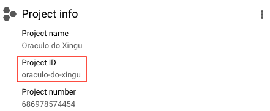

# Paquetes

Los paquetes de Base de los Datos permiten el acceso al *data lake* público
directamente desde tu computadora o entorno de desarrollo. Actualmente disponibles en:

- **:material-language-python: Python**
- **:material-language-r: R**
- **Stata**
- **:octicons-terminal-16: CLI (terminal)**

¿Listo(a) para empezar? En esta página encontrarás:

- [Primeros pasos](#primeros-pasos)
- [Tutoriales](#tutoriales)
- [Manuales de referencia](#manuales-de-referencia-api)

## Primeros pasos

### Antes de empezar: Crea tu proyecto en Google Cloud

Para crear un proyecto en Google Cloud solo necesitas tener un correo registrado en
Google. Es necesario tener un proyecto propio, aunque esté vacío, para poder
hacer consultas en nuestro *data lake* público.

1. **[Accede a Google Cloud](https://console.cloud.google.com/projectselector2/home/dashboard)**.
   Si es tu primera vez, acepta los Términos de Servicio.
2. **Haz clic en `Create Project/Crear Proyecto`**. Elige un buen nombre para el proyecto.
3. **Haz clic en `Create/Crear`**

??? Info "¿Por qué necesito crear un proyecto en Google Cloud?"
    Google proporciona 1 TB gratuito por mes de uso de BigQuery para cada
    proyecto que posees. Un proyecto es necesario para activar los
    servicios de Google Cloud, incluyendo el permiso de uso de BigQuery.
    Piensa en el proyecto como la "cuenta" en la que Google contabilizará
    cuánto procesamiento has utilizado. **No es necesario agregar
    ninguna tarjeta o forma de pago - BigQuery inicia automáticamente en modo Sandbox, que te permite utilizar sus recursos sin agregar un método de pago. [Lee más aquí](https://cloud.google.com/bigquery/docs/sandbox/?hl=es).**

### Instalando el paquete

Para la instalación del paquete en Python y línea de comandos, puedes usar
`pip` directamente desde tu terminal. En R, basta con instalarlo directamente en
RStudio o el editor de tu preferencia.

=== "**Python/CLI**"
    ```bash
    pip install basedosdados
    ```

=== "**R**"
    ```R
    install.packages("basedosdados")
    ```

=== "**Stata**"

Requerimientos:

1. Asegurarte de que tu Stata sea la __versión 16+__
2. Asegurarte de que Python esté instalado en tu computadora.

Con los requerimientos satisfechos, ejecutar los comandos siguientes:
```stata
net install basedosdados, from("https://raw.githubusercontent.com/basedosdados/mais/master/stata-package")
```

### Configurando el paquete

Una vez con tu proyecto, necesitas configurar el paquete para usar el ID
de ese proyecto en las consultas al *datalake*. Para esto, debes usar el
`project_id` que Google te proporciona tan pronto como el
proyecto es creado.



=== "Python/CLI"
    *No es necesario configurar el proyecto de antemano. Tan pronto como ejecutes
    la primera consulta, el paquete indicará los pasos para la configuración.*

=== "R"
    *Una vez con el `project_id`, debes pasar esta
    información al paquete usando la función `set_billing_id`.*
    ```R
    set_billing_id("<YOUR_PROJECT_ID>")
    ```

=== "Stata"
    *Es necesario especificar el `project_id` cada vez que uses el paquete.*

### Haz tu primera consulta

Un ejemplo simple para empezar a explorar el *datalake* es obtener información catastral de
municipios directamente en nuestra base de [Directorios Brasileños (tabla `municipio`)](https://basedosdados.org/dataset/br-bd-diretorios-brasil). Para esto, usaremos la
función `download`, descargando los datos directamente a nuestra máquina.

=== "Python"
    ```python
    import basedosdados as bd
    bd.download(savepath="<PATH>",
    dataset_id="br-bd-diretorios-brasil", table_id="municipio")
    ```

    *Para entender más sobre la función `download`, lee el [manual de referencia](../api_reference_python).*

=== "R"
    ```R
    library("basedosdados")
    query <- "SELECT * FROM `basedosdados.br_bd_diretorios_brasil.municipio`"
    dir <- tempdir()
    data <- download(query, "<PATH>")
    ```

    *Para entender más sobre la función `download`, lee el [manual de referencia](../api_reference_r).*

=== "Stata"
    ```stata
    bd_read_sql, ///
        path("<PATH>") ///
        query("SELECT * FROM `basedosdados.br_bd_diretorios_brasil.municipio`") ///
        billing_project_id("<PROJECT_ID>")
    ```

=== "CLI"
    ```bash
    basedosdados download "where/to/save/file" \
    --billing_project_id <YOUR_PROJECT_ID> \
    --query 'SELECT * FROM
    `basedosdados.br_bd_diretorios_brasil.municipio`'
    ```
    *Para entender más sobre la función `download`, lee el [manual de referencia](../api_reference_cli).*

## Tutoriales

### Cómo usar los paquetes

Preparamos tutoriales presentando las principales funciones de cada paquete
para que empieces a usarlos.

=== "**Python**"
    Blog:

    - [Introducción al paquete Python](https://dev.to/basedosdados/base-dos-dados-python-101-44lc)
    - [Introducción al paquete Python (cont.)](https://dev.to/basedosdados/base-dos-dados-python-102-50k0)

    Videos:

    - [Workshop: Aplicaciones en Python](https://www.youtube.com/watch?v=wI2xEioDPgM)

=== "**R**"
    Blog:

    - [Introducción al paquete R](https://dev.to/basedosdados/como-usar-a-biblioteca-basedosdados-no-r-capitulo-1-46kb)
    - [Explorando el Censo Escolar](https://dev.to/basedosdados/explorando-o-censo-escolar-com-a-base-dos-dados-1a89)
    - [Análisis: Brasil en las Olimpiadas](https://dev.to/basedosdados/o-brasil-nas-olimpiadas-2g6n)

    Videos:

    - [Workshop: Aprende a acceder a datos públicos en R](https://www.youtube.com/watch?v=M9ayiseIjvI&t=250s)

=== "**Stata**"
    Documentación:

    - [GitHub](https://github.com/basedosdados/mais/tree/master/stata-package)

## Manuales de referencia (API)

* [:material-language-python: Python](../api_reference_python)
* [:material-language-r: R](../api_reference_r)
* [Stata](../api_reference_stata)
* [:octicons-terminal-16: CLI](../api_reference_cli)
