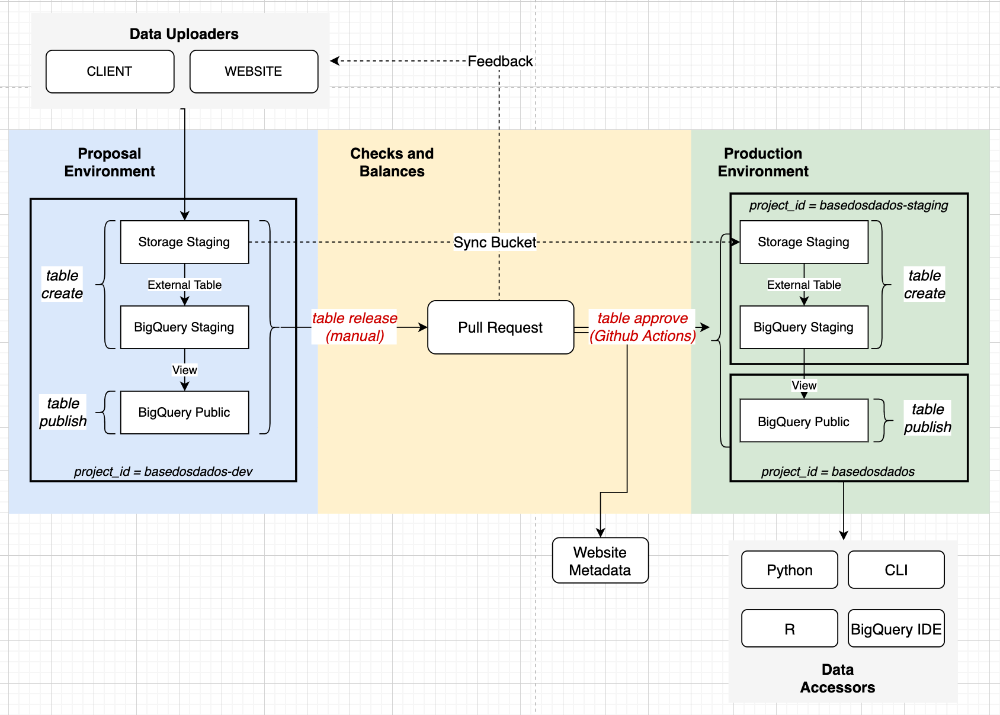

# Infraestructura de BD

Nuestro equipo de infraestructura se asegura de que todos los paquetes y pipelines
funcionen de la mejor manera para el público. Utilizamos Github
para gestionar todo el código y mantenerlo organizado, donde puedes encontrar
issues de nuevas funcionalidades, errores y mejoras en las que estamos trabajando.

## Cómo funciona nuestra infraestructura

Nuestra infraestructura se compone de 3 frentes principales:

- [**Sistema de ingestión de datos**](#sistema-de-ingestion-de-datos): desde la carga hasta la
  disponibilización en producción;
- [**Paquetes de acceso**](#paquetes-de-acceso)
- [**Sitio web**](#sitio-web): Front-end, Back-end y APIs.

Actualmente es posible colaborar en todos los frentes, con énfasis en el
desarrollo de los pesos y contrapesos y la actualización del sitio.

!!! Tip "¡Sugerimos que te unas a nuestro [canal de Discord](https://discord.gg/huKWpsVYx4) para resolver dudas e interactuar con otros(as) colaboradores(as)! :)"

## Sistema de ingestión de datos

El sistema tiene ambientes de desarrollo
(`basedosdados-dev`), homologación (`basedosdados-staging`) y producción
(`basedosdados`) en BigQuery. Los procesos para la subida de datos están
detallados en la imagen de abajo, siendo algunos de ellos automatizados
vía Github Actions.

Explicamos con más detalles el funcionamiento de este sistema [en el blog](https://dev.to/basedosdados/como-funciona-o-sistema-de-insercao-de-dados-na-bd-25dk).

### ¿Cómo contribuir?

- Mejorando la documentación del sistema aquí :)
- [Creando verificaciones automáticas de calidad de datos y metadatos (en Python)](https://github.com/basedosdados/mais/issues/376)
- [Creando nuevos issues y sugerencias de mejoras](https://github.com/basedosdados/mais/issues/new/choose)

## Paquetes de acceso

Los paquetes de acceso al *datalake* están en constante mejora y puedes
colaborar con nosotros con nuevas funcionalidades, corrección de errores y mucho
más.

### ¿Cómo contribuir?

- [Explora los issues del paquete Python](https://github.com/basedosdados/mais/labels/python)
- [Explora los issues del paquete R](https://github.com/basedosdados/mais/labels/R)
- [Ayuda a desarrollar el paquete en Stata](https://github.com/basedosdados/mais/pull/754)

## Sitio web

Nuestro sitio web está desarrollado en
[Next.js](https://nextjs.org/learn/basics/create-nextjs-app) y consume
una API de metadatos de CKAN. El código del sitio también está en nuestro [Github](https://github.com/basedosdados/website).

### ¿Cómo contribuir?

- [Mejora el UX del sitio (Next, CSS, HTML)](https://github.com/basedosdados/website#editando-html)
- [Ayudando en issues abiertos de BE, FE o API](https://github.com/basedosdados/website/issues)
- [Creando nuevos issues y sugerencias de mejoras](https://github.com/basedosdados/website/issues/new)
