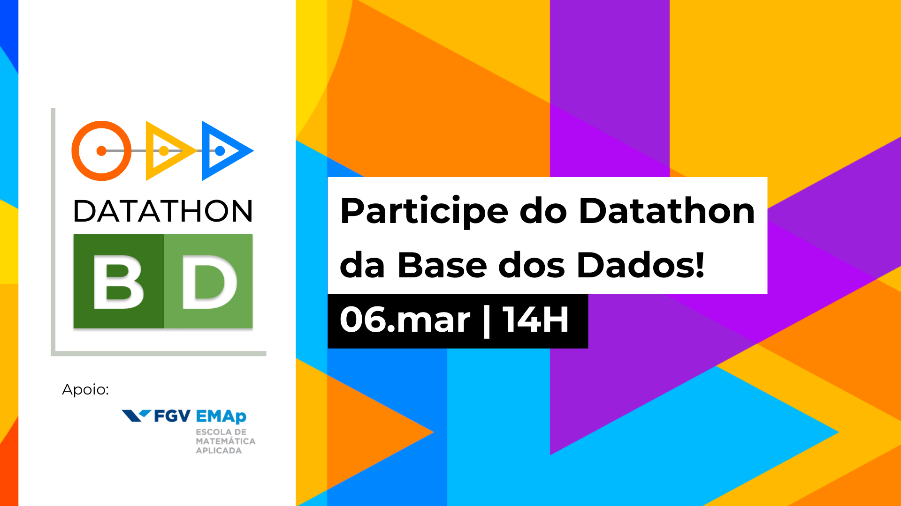

<!-- Header -->

    

---

# Open Data Day: Datathon BD

**Que tal explorar dados públicos com a gente neste Dia dos Dados Abertos?**

Em parceria à Escola de Matemática Aplicada da FGV, a Base dos Dados trará um evento apresentando sobre a nossa iniciativa, os cursos de formação em dados da FGV e exemplos de aplicações com nosso data lake público. Para fechar o evento com chave de ouro, lançaremos nosso primeiro de muitos Datathons!

## Por que participar?

Essa é uma ótima oportunidade de aprender mais sobre dados públicos e
conhecer pessoas interessantes! **As melhores análises serão
publicadas no nosso site e nas redes.**

A Base dos Dados tem a missão de universalizar o acesso a dados no
Brasil. Coletamos bases que são públicas mas são difíceis de manusear e
organizar, e criamos uma forma super fácil de usá-las. **Acreditamos que
a distância entre você e uma análise de dados deveria ser apenas uma boa
pergunta.**

Fazemos tudo isso por meio de um mecanismo de busca, com 900+ bases catalogadas; e nosso data lake público que já tem mais de 30 bases públicas tratadas, integradas e prontas para uso. O trabalho é voluntário e mantido por nossa comunidade, formada por programadores, pesquisadores e entusiastas de dados.

## Cronograma

| | | 
| --- | ---- |
| 14H | Abertura: Base dos Dados e FGV/EMAp |
| 14:40 | Workshop: Analisando dados públicos na BD+ |
| 15:40 | Lançamento do Datathon BD+ |

#### Todo o evento irá acontecer no [nosso canal do Discord!](https://discord.gg/tuaFbAPeq5)

## O que é o Dia dos Dados Abertos?
O Dia dos Dados Abertos é uma celebração anual dos dados abertos em todo o mundo. Grupos de todas as partes do mundo criaram eventos locais no dia em que usarão dados abertos em suas comunidades. É uma oportunidade para mostrar os benefícios dos dados abertos e encorajar a adoção de políticas de dados abertos no governo, empresas e na sociedade civil.

Todos os resultados são abertos para que todos usem e reusem. [Veja mais
sobre o Dia de Dados Abertos.](https://opendataday.org/pt_br/)