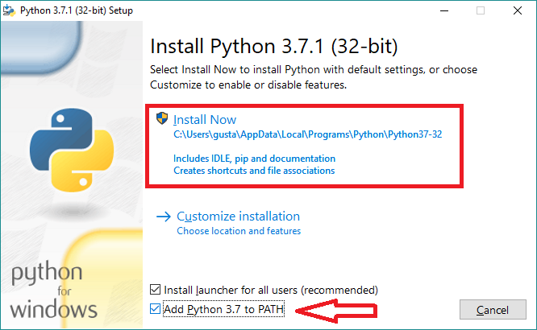
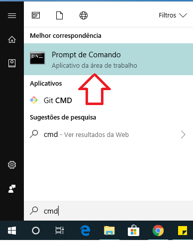

# Mini Tutorial Python para o pacote Stata

# 1. Introdução

Esse Mini Tutorial tem como público alvo os novos usuários do pacote de [Stata](https://github.com/basedosdados/mais/tree/master/stata-package) da Base dos Dados. 
O tutorial é rápido e tem como objetivo mostrar como instalar o Python e autorizar seu projeto do Google - requirimentos obrigatórios para uso do pacote do Stata.
>  __Porque instalar o Python é necessário?__
> A meta futura é que o pacote tenha sua dependência no próprio Stata, porém essa primeira versão ainda é um _wrapper_ do pacote do Python. Por outro lado, isso não significa que você precisa saber Python para usá-lo, pelo contrário. Seguindo os passos abaixo, não será necessário nem abrir o software para configurar o pacote do Stata.  
# 2. Passo a Passo

 __Passo 1.__ Clique [aqui](https://www.python.org/downloads/) na opção "Download Python" para baixar o Python. Em seguida, siga as instruções da tela e, principalmente, _não esqueça_ de marcar a opção "add to path": 

    

__Passo 2.__ Após instalar o Python, abra o menu iniciar, digite "cmd" e abra. Na tela do "Prompt de Comando" que aparecerá, digite `pip install basedosdados -U` e dê enter.

    

__Passo 3.__ Após concluir a instalação do pacote basedosdados, digite `basedosdados reauth` no Prompt de Comando. Copie o link que aparecerá, cole na sua aba de navegação e dê autorização ao google. Em seguida, copie o código gerado, volte e cole na tela do Prompt e dê enter.

>  Caso esteja utilizando os dados da BD pela primeira vez, é necessário criar um projeto para que você possa fazer as queries no nosso repositório. Ter um projeto é de graça e basta ter uma conta Google (seu gmail por exemplo). [Veja aqui como criar um projeto no Google Cloud](https://basedosdados.github.io/sdk/access_data_bq/#antes-de-comecar-crie-o-seu-projeto-no-google-cloud).

Após finalizar esses 3 passos, já será possível abrir o Stata e começar a usar o pacote. Para saber mais sobre os comandos do pacote, leia esse manual [aqui](https://github.com/basedosdados/mais/tree/master/stata-package). 
