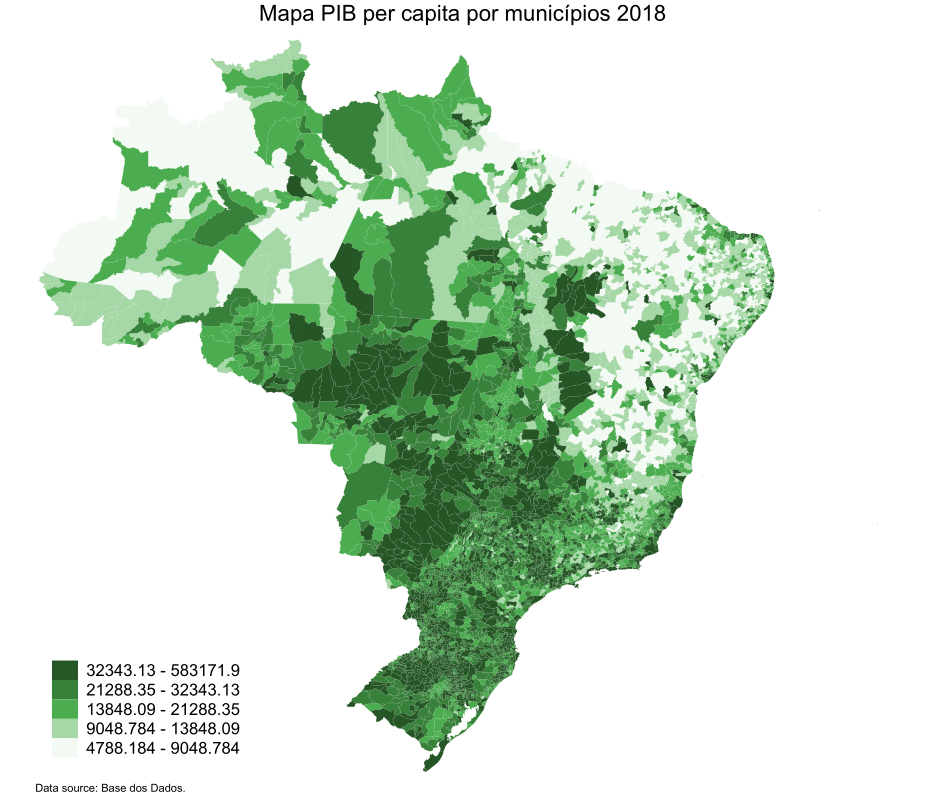
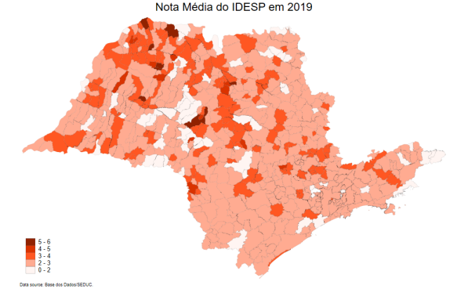

# Pacote Stata

__Guia__  
1. [Introdução](#1-introdução)
2. [Instalação](#2-instalação-e-requerimentos)
3. [Sintaxe](#3-sintaxe)
4. [Exemplos](#4-exemplos)
    1. [PIB per capita dos municípios brasileiros](#41-PIB-per-capita-dos-municípios-brasileiros)
    2. [Nota média do IDESP 2019](#42-nota-média-do-IDESP-2019)

# 1. Introdução

O pacote `basedosdados` no Stata possibilita o acesso a [centenas de tabelas tratadas e compatibilizadas](https://basedosdados.org/dataset?resource_type=bdm_table), disponíveis no datalake público BD+ da Base dos Dados. O pacote consiste em 7 comandos. Os comandos dão desde a possibilidade de listar todos os conjuntos de dados disponíveis do BD+ datalake até baixá-los ou analisá-los diretamente do Stata. Importante ressaltar que essa versão inicial ainda é um __wrapper__ do pacote do Python, e, portanto, necessita da execução de alguns passos antes da utilização. 


# 2. Instalação e requerimentos

A instalação do pacote `basedosdados` no Stata consiste basicamente na execução desses 2 passos: 
1. Garantir que seu Stata seja a __versão 16+__
2. Garantir que o Python esteja instalado no seu computador - você pode se guiar pelo nosso Mini Tutorial de Python [aqui](https://github.com/basedosdados/stata-package/blob/main/Minitutorial.md). Nesse tutorial você também vai descobrir como autenticar seu projeto pelo prompt do seu computador (__importante!__).

>  Caso esteja utilizando os dados da BD pela primeira vez, é necessário criar um projeto para que você possa fazer as queries no nosso repositório. Ter um projeto é de graça e basta ter uma conta Google (seu gmail por exemplo). [Veja aqui como criar um projeto no Google Cloud](https://basedosdados.github.io/mais/access_data_local/#criando-um-projeto-no-google-cloud).

Após garantir esses dois requerimentos __obrigatórios__, você pode finalmente instalar o pacote digitando o seguinte comando no seu Stata: 

```stata
net install basedosdados, from("https://raw.githubusercontent.com/basedosdados/stata-package/master/")
```

# 3. Sintaxe

Se é a sua primeira vez utilizando o pacote, digite ```db basedosdados``` e confirme novamente se as etapas acima foram concluídas com sucesso. 

O pacote contém 7 comandos, conforme suas funcionalidades descritas abaixo: 

| __Comando__               | __Descrição__                                                                  |
|---------------------------|--------------------------------------------------------------------------------|
| `bd_download`             | baixa dados da Base dos Dados (BD+).                                           |
| `bd_read_sql`             | baixa tabelas da BD+ usando consultas específicas.                             |
| `bd_read_table`           | baixa tabelas da BD+ usando `dataset_id` e `table_id`.                         |
| `bd_list_datasets`        | lista o `dataset_id` dos conjuntos de dados disponíveis em `query_project_id`. |
| `bd_list_dataset_tables`  | lista `table_id` para tabelas disponíveis no `dataset_id` especificado.        |
| `bd_get_table_description`| mostra a descrição completa da tabela BD+.                                     |
| `bd_get_table_columns`    | mostra os nomes, tipos e descrições das colunas na tabela especificada.        |

Cada comando tem um __help file__ de apoio, bastando abrir o help e seguir as instruções:

```
help [comando]
```

# 4. Exemplos
## 4.1 PIB per capita dos municípios brasileiros

```stata
//------------------------//
// DADOS
//------------------------//

bd_read_sql, ///
    path("pib_pc_municipio.csv") ///
    query("SELECT pib.id_municipio, pop.ano, pib.PIB / pop.populacao as pib_pc FROM `basedosdados.br_ibge_pib.municipio` as pib INNER JOIN `basedosdados.br_ibge_populacao.municipio` as pop ON pib.id_municipio = pop.id_municipio AND pib.ano = pop.ano") ///
    billing_project_id("<PROJECT_ID>")

keep if ano == 2018

tempfile pib_pc
save `pib_pc'

//------------------------//
// TRATAMENTO E ANÁLISE
//------------------------//

use dadosmapa/brasildata.dta, clear

cap ren CD_GEOCODI id_municipio
cap ren CD_GEOCODM id_municipio 
cap ren CD_GEOCODS id_municipio 
destring id_municipio, replace

merge 1:1 id_municipio using `pib_pc', keep(3)

colorpalette w3 green, n(5) nograph // paleta 
local colors `r(p)'

*** MAPA ***
spmap pib_pc using brasilcoor.dta, id(id) name(m2019, replace) cln(5) ocolor(black ..) osize(0.0 ..) fcolor("`colors'") ///
  legend(pos(7) size(*1)) legstyle(2) title("Mapa PIB per capita por municípios 2018", size(small)) ///
   note("Data source: Base dos Dados." , size(tiny)) 
```

:point_right: Mais sobre fazer mapas no stata [aqui](https://medium.com/the-stata-guide/maps-in-stata-ii-fcb574270269).
<p align="center">
    <a href="https://github.com/basedosdados/stata-package/blob/main/examples/m2018-1.png">
    
    </a>
</p>

## 4.2 Nota média do IDESP 2019

```stata
//------------------------//
// DADOS
//------------------------//

bd_read_sql, ///
    path("~/Downloads/SP_2019.csv") ///
    query("SELECT id_municipio, AVG(nota_idesp_em) as nota_em FROM `basedosdados.br_sp_seduc_idesp.escola` WHERE ano = 2019 GROUP BY id_municipio") ///
    billing_project_id("<PROJECT_id>")

tempfile idesp
save `idesp', replace 

//------------------------//
// TRATAMENTO E ANÁLISE
//------------------------//

use dadosmapa/spdata.dta, clear

ren CD_GEOCODI id_municipio
destring id_municipio, replace

merge 1:1 id_municipio using `v', keep(3)

colorpalette w3 deep-orange, n(5) nograph // paleta de cores 
local colors `r(p)'

*MAPA
spmap nota_em using brasilcoor.dta, id(id) name(m2019, replace) cln(5) ocolor(black ..) osize(0.01 ..) fcolor("`colors'")   clmethod(custom) clb(0 2 3 4 5:6 ) ///
  legend(pos(7) size(*1)) legstyle(2) title("Nota Média do IDESP em 2019", size(medium)) ///
   note("Data source: Base dos Dados/SEDUC." , size(tiny)) 
```

<p align="center">
    <a href="https://github.com/basedosdados/stata-package/blob/main/examples/idesp_mapa.png">
    
    </a>
</p>
